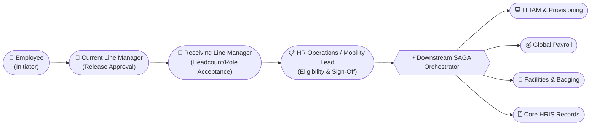
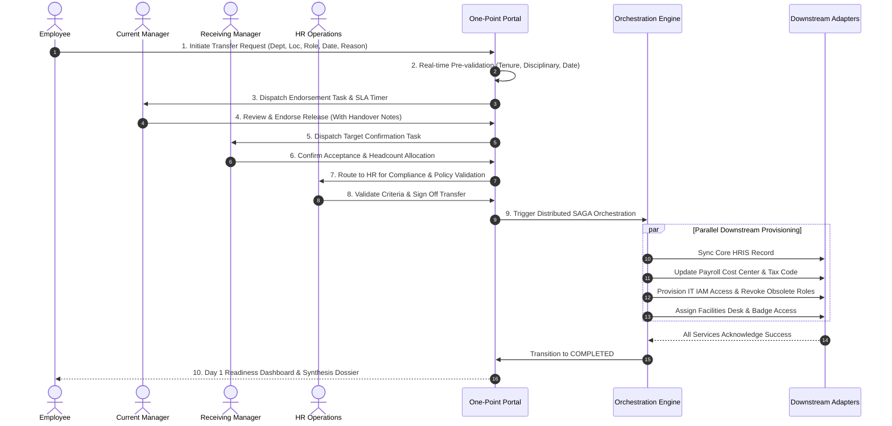

# Business Requirements Document (BRD)
## Project: One-Point Employee Portal — Internal Transfer Digital Journey

- **Document ID:** `BRD-EIT-001`
- **Document Version:** v1.0.0
- **Status:** Pending Review (Gate 0)
- **Author:** Lead SDD Engineer / Solutions Architect
- **Assigned Gate 0 Reviewer(s):** Supratim Jetty (`supratim.jetty@intglobal.com`)

- **Source Document:** `docs/01_requirement_discovery_analysis.md`
- **Last Updated:** 2026-09-14

---

## 1. Business Objective & Context

### 1.1 Executive Summary
In the legacy operating model, an employee seeking an internal transfer experiences an uncoordinated, multi-system, and high-friction journey. The process requires manual coordination across the transferring employee, current line manager, prospective receiving manager, HR Operations, Global Payroll, IT Access Management, and Corporate Facilities.

This introduces severe operational issues:
- **Extended Cycle Time**: 28–42 calendar days from intent to completed handover.
- **Zero Real-time Visibility**: Employees lack tracking capabilities into request status, pending approvals, or downstream blockers.
- **Compliance & Payroll Errors**: Discrepancies in effective dates and cross-entity cost-center mapping cause payroll misalignments and delayed IT provisioning.
- **Talent Attrition**: Slow internal mobility drives employees to seek external career opportunities.

### 1.2 Strategic Objectives & Target KPIs
Unify internal talent mobility into a **single, event-driven digital journey** with automated downstream orchestration.

| Target Metric | Baseline (As-Is) | Target (To-Be SDD Journey) | Business Value |
| :--- | :--- | :--- | :--- |
| **End-to-End Cycle Time** | 35 Calendar Days | $\le 5$ Business Days | $85\%$ reduction in administrative turnaround |
| **Self-Service Visibility** | $0\%$ (Email/Ticket chasing) | $100\%$ Real-time status & SLA tracking | Eliminates HR inquiry ticket volume |
| **Data Integrity / First-Time-Right** | $62\%$ (Manual entry errors) | $\ge 99.5\%$ (Automated validation & sync) | Zero payroll mismatch on Day 1 in new role |
| **IT & Facilities Readiness** | Day +3 to Day +7 (Late access) | Day 0 (Ready on Effective Date) | Immediate employee productivity upon transfer |
| **Audit Compliance** | Fragmented email threads | $100\%$ Immutable, cryptographic audit trail | Instant regulatory and SOC2 compliance |

---

## 2. Actors & Stakeholder Personas

### 2.1 Persona Definitions
1. **Transferring Employee (Initiator)**: Permanent full-time employee seeking internal mobility. Explores open requisitions, runs self-service pre-flight checks, submits transfer dossiers, and monitors progress via live timeline.
2. **Current Line Manager (Releasing Stakeholder)**: Evaluates team delivery impact, agrees on release date, provides structured handover notes, and approves/rejects with rationale.
3. **Receiving Line Manager (Accepting Stakeholder)**: Confirms open headcount code, validates candidate suitability, accepts proposed start date, and prepares onboarding.
4. **HR Business Partner / Mobility Lead (Gatekeeper)**: Evaluates tenure, performance rating, disciplinary records, salary band alignment, and grants final authorization triggering automated orchestration.
5. **IT IAM Operations**: Role-based access provisioning, group assignments, software license migration, and hardware dispatch.
6. **Payroll Operations**: Re-maps cost-center allocations, tax jurisdiction updates, and salary band delta adjustments.
7. **Facilities / Workplace Services**: Office access card badging, desk assignment, and parking access.

---

## 3. Functional Scope & Digital Journey Stages

---

## 4. Functional Requirements (BRD-FR)

| Req ID | Title | Description | Primary Actor |
| :--- | :--- | :--- | :--- |
| **BRD-FR-001** | **Profile & Role Auto-Population** | System auto-populates employee profile, current department, location, supervisor, and tenure upon portal launch. | Employee |
| **BRD-FR-002** | **Pre-Flight Eligibility Engine** | Real-time pre-submission check evaluating tenure ($\ge 12\text{m}$), performance rating ($\ge 3.0$), active disciplinary status, and 30-day notice period. | Employee |
| **BRD-FR-003** | **Drafting & Private Initiation** | Employees can save drafts privately (`DRAFT`). Current manager is only notified upon formal submission (`SUBMITTED`). | Employee |
| **BRD-FR-004** | **Single Active Request Guard** | System restricts employees to one active in-flight transfer request at any given time. | System |
| **BRD-FR-005** | **Current Manager Endorsement** | Current manager reviews request with 5-day SLA, inputs handover transition notes, and endorses release. | Current Manager |
| **BRD-FR-006** | **Receiving Manager Acceptance** | Receiving manager validates open headcount requisition code and accepts candidate and effective date. | Receiving Manager |
| **BRD-FR-007** | **HR Policy & Compliance Validation** | HR Partner reviews compensation equivalence, confirms policy adherence, and provides formal authorization. | HR Partner |
| **BRD-FR-008** | **Voluntary Withdrawal** | Employee may unconditionally withdraw transfer at any point prior to HR final sign-off. | Employee |
| **BRD-FR-009** | **Mandatory Rejection Rationale** | Any stakeholder rejection terminates the request into `REJECTED` state and requires mandatory justification comments ($\ge 20$ chars). | Any Stakeholder |
| **BRD-FR-010** | **Live Journey Stepper** | Interactive 6-stage visual timeline rendering current responsible party, completed milestones, timestamps, and SLA timers. | All Stakeholders |
| **BRD-FR-011** | **Distributed SAGA Orchestration** | Asynchronous downstream provisioning across HRIS, Payroll, IT IAM, and Facilities with retry backoff and idempotency keys. | System |
| **BRD-FR-012** | **Cryptographic Audit Trail** | Immutable SHA-256 hash-chained ledger logging every state change, administrative action, and stakeholder decision. | Auditor / HR |

---

## 5. Core Business Rules (BR-001 to BR-015)

| Rule ID | Category | Business Rule Description | Enforcement Point |
| :--- | :--- | :--- | :--- |
| **BR-001** | Tenure | Minimum 12 consecutive months of service in current role required. | Pre-flight & HR Review |
| **BR-002** | Performance | Latest performance appraisal rating must be $\ge 3.0$ ("Meets Expectations"). | Pre-flight & HR Review |
| **BR-003** | Disciplinary | No active PIP (Performance Improvement Plan) or formal disciplinary record in past 6 months. | Pre-flight & HR Review (Hard Block) |
| **BR-004** | Notice Period | Proposed effective transfer date must be at least 30 calendar days from submission date. | Form Validation |
| **BR-005** | Headcount Requisition | Receiving department must possess an active, approved, unfulfilled requisition position code. | Form Selection & Receiving Mgr Review |
| **BR-006** | Single Active Transfer | Employee may have only one active transfer request in flight at any given time. | Initiation Submission |
| **BR-007** | Approval Sequence | Current Manager $\rightarrow$ Receiving Manager $\rightarrow$ HR Operations. Steps cannot be bypassed or executed out of order. | State Machine Guard |
| **BR-008** | Withdrawal Rights | Employee may withdraw request at any point before HR final approval. Withdrawal is locked once SAGA starts. | Portal Action |
| **BR-009** | Rejection Finality | Rejection immediately transitions request to terminal `REJECTED` state with mandatory justification. | State Machine Guard |
| **BR-010** | SLA Auto-Escalation | Manager review SLA is 5 business days; automatic escalation dispatched to Department Head on Day 7. | Schedulers / Cron |
| **BR-011** | Cross-Entity Taxation | Transfers across different legal entities or tax jurisdictions require tax addendum sign-off before SAGA trigger. | HR Validation Stage |
| **BR-012** | IT Access Isolation | Legacy department-specific high-privilege access keys scheduled for revocation at 23:59 on Effective Date - 1. | IT Provisioning Adapter |
| **BR-013** | Compensation Band Check | Target role salary grade must fall within standardized grade pay bands; deviations $> 15\%$ require Comp Committee flag. | HR Validation Stage |
| **BR-014** | Audit Immutability | Every state transition, comment, and payload recorded in an append-only SHA-256 hash-chained ledger. | All State Transitions |
| **BR-015** | Idempotent Orchestration | Downstream provisioning calls accept unique idempotency key (`TransferRequestID + StepName + Version`). | SAGA Execution |

---

## 6. Non-Functional Requirements (BRD-NFR)

| NFR ID | Category | Requirement Baseline |
| :--- | :--- | :--- |
| **BRD-NFR-001** | **Performance & Latency** | REST API $p95$ response time $< 200$ms under concurrent load. |
| **BRD-NFR-002** | **Availability & SLA** | System availability target $\ge 99.5\%$; operational turnaround SLA $\le 5$ business days. |
| **BRD-NFR-003** | **Security & Access Control** | Zero-trust Object-Level Access Control (OLAC / BOLA defense) enforcing strict IDOR protection. |
| **BRD-NFR-004** | **Data Privacy (PII)** | Employee PII, performance ratings, and salary details encrypted at rest and masked in logs. |
| **BRD-NFR-005** | **Fault Tolerance & Resilience** | Downstream adapters support exponential backoff retries (up to 5 attempts: 1s, 2s, 4s, 8s, 16s). |
| **BRD-NFR-006** | **Auditability** | Cryptographic SHA-256 hash chain guaranteeing tamper-evident audit logs. |

---

## 7. Assumptions & Dependencies

### 7.1 Assumptions
- **A-01:** Enterprise SSO / OIDC provides authenticated JWT tokens with employee identity and claims.
- **A-02:** Enterprise Core HRIS exposes reliable APIs for master data updates.
- **A-03:** System clocks across all nodes are synchronized via NTP for timestamp integrity.

### 7.2 External Dependencies
- **Core HRIS:** Workday / SAP SuccessFactors for organizational hierarchy and title sync.
- **Global Payroll:** SAP / ADP for cost-center and tax code reassignment.
- **IT IAM & Provisioning:** Okta / Active Directory / ServiceNow for role assignment and ticket management.
- **Facilities CAFM:** Condeco / Archibus for physical access badge and workstation allocation.

---

## 8. Explicitly Out of Scope

- ❌ External candidate recruitment and ATS integration.
- ❌ Direct relocation expense payments and physical moving receipts.
- ❌ Automated consular visa and embassy work permit filings.
- ❌ Annual performance appraisal conducting (consumed read-only).
- ❌ Bulk mass organizational restructuring transfers.

---

## 9. Known Decisions & Open Questions

### 9.1 Known Decisions
1. **Single Entry Point**: All transfer requests must originate through the One-Point Portal UI / API.
2. **Private Drafting**: Incomplete applications remain `DRAFT` and invisible to line managers until formal submission.
3. **Resilience Strategy**: 5-attempt retry backoff with automatic escalation to `MANUAL_INTERVENTION_REQUIRED` on persistent failures.

### 9.2 Open Questions
- **OQ-1:** Counter-proposal workflow for manager date renegotiation (Resolved: Remarks in v1.0, transition state in v1.1).
- **OQ-2:** Compensation band adjustment acknowledgement (Resolved: Handled in Stage 4 HR review).
- **OQ-3:** Cross-border visa handling (Resolved: Tagged `CROSS_BORDER_TRANSFER` with mandatory offline legal addendum).

---

## 10. High-Level Acceptance Criteria
1. Employee can view pre-populated profile and run instant pre-flight eligibility check.
2. Ineligible employees (tenure $< 12\text{m}$, rating $< 3.0$, active PIP, notice $< 30$ days) are blocked with specific error messages.
3. Successful initiation dispatches action item to current manager with 5-day SLA timer.
4. Managers and HR can approve with remarks or reject with mandatory justification ($\ge 20$ characters).
5. HR final sign-off triggers parallel downstream SAGA orchestration across HRIS, Payroll, IT, and Facilities.
6. Temporary downstream network failures automatically recover via retry backoff without human intervention.
7. SHA-256 hash chain proves audit integrity; any tampering is detected during automated verification.
