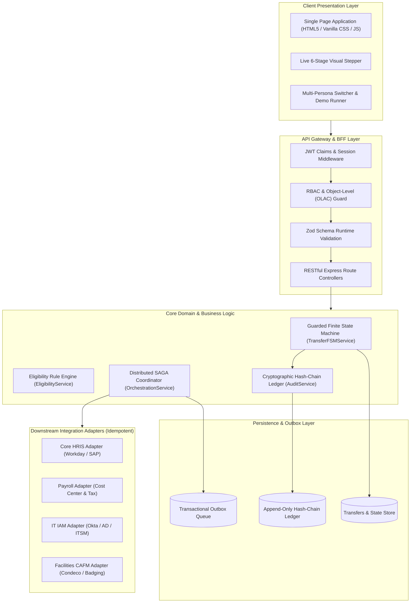

# System Architecture: One-Point Employee Portal — Internal Transfer Digital Journey

## 1. Architectural Style & Principles
The One-Point Employee Portal follows a **Modular Clean Architecture** pattern designed as a **Modular Monolith + Microservice Ready** system.

---

## 2. Component Design & Responsibilities

### 2.1 API & BFF Layer
- **Endpoint Prefix:** `/api/v1`
- **Authentication & Claims:** Evaluates JWT tokens and injects user identity into request context (`userId`, `role`, `departmentId`).
- **Object-Level Access Control (OLAC):** Validates that caller identity matches either the initiator, current line manager, receiving manager, or an HR Partner claim before granting access to specific transfer records.
- **Request Validation:** Validates payload schemas at runtime using Zod, ensuring fail-fast input rejection.

### 2.2 Core Domain Engine
- **TransferFSMService:** Implements a guarded Finite State Machine enforcing 11 lifecycle states:
  - `DRAFT` $\rightarrow$ `SUBMITTED` $\rightarrow$ `PENDING_CURRENT_MGR_APPROVAL` $\rightarrow$ `PENDING_RECEIVING_MGR_APPROVAL` $\rightarrow$ `PENDING_HR_VALIDATION` $\rightarrow$ `ORCHESTRATING_DOWNSTREAM` $\rightarrow$ `COMPLETED`
  - Guard transitions to terminal states `REJECTED`, `WITHDRAWN`, and `MANUAL_INTERVENTION_REQUIRED`.
- **EligibilityService:** Evaluates 4 core business rules:
  1. Minimum 12 months tenure (`BR-001`)
  2. Performance rating $\ge 3.0$ (`BR-002`)
  3. No active disciplinary action or PIP (`BR-003`)
  4. Minimum 30 calendar days notice before effective date (`BR-004`)
- **AuditService:** Computes an append-only SHA-256 cryptographic hash-chain ledger over every lifecycle state mutation.

### 2.3 Distributed SAGA Orchestration
- **Transactional Outbox Pattern:** Upon HR approval, downstream integration tasks are enqueued into an outbox table.
- **Parallel Dispatch:** Adapters for Core HRIS, Payroll, IT IAM, and Facilities CAFM execute concurrently.
- **Idempotency & Retry Backoff:** External calls supply idempotency keys. Transient failures (e.g. HTTP 503) trigger exponential retry backoff (1s, 2s, 4s, 8s, 16s). Exhaustion triggers `MANUAL_INTERVENTION_REQUIRED`.

### 2.4 Optimistic Concurrency Control
All transfer entity updates enforce version matching (`expectedVersion`). Concurrent conflicting requests fail with HTTP 409 Conflict.
