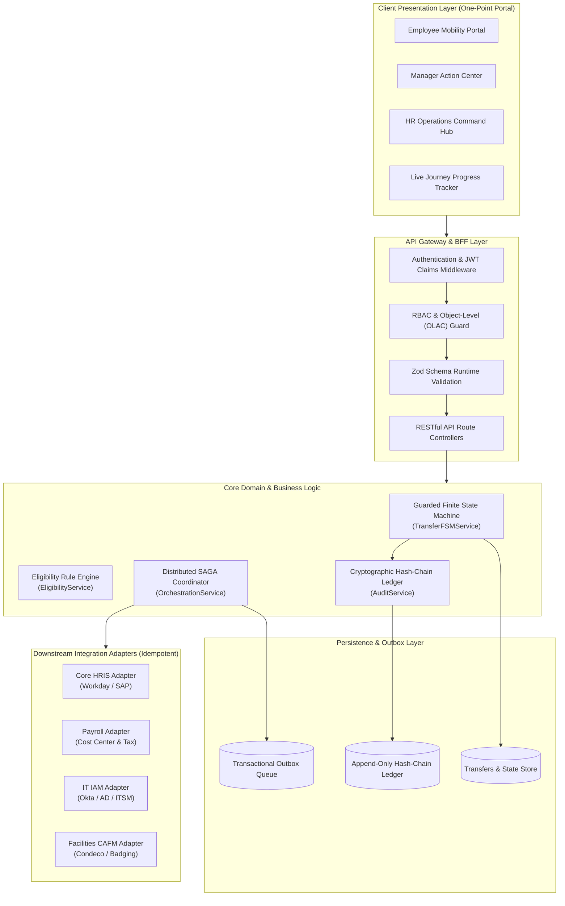
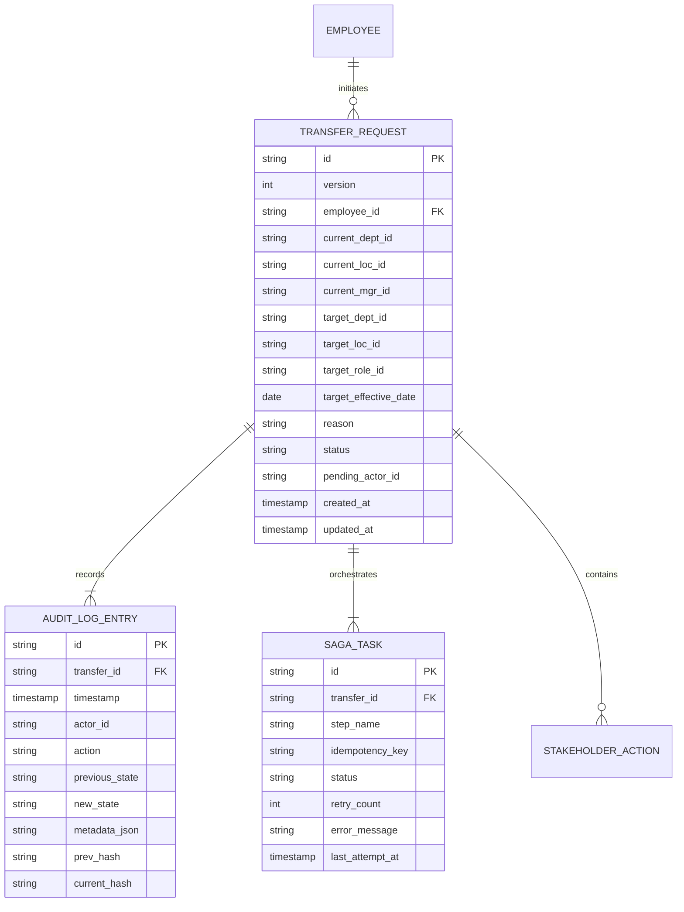
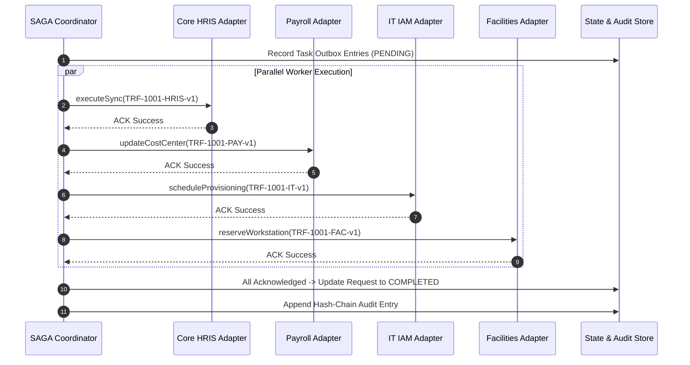

# Deliverable 4: Technical Plan & Architecture (.plan.md)
## System Architecture & Technical Design Specification
- **Project**: One-Point Employee Portal — Internal Transfer Digital Journey
- **Document ID**: `PLAN-EIT-001`
- **Methodology**: INT Specification-Driven Development/Delivery (SDD)
- **Status**: Baselined (Gate 1 Output)
- **Target Platform**: Node.js / TypeScript / Modular Clean Architecture / Event-Driven SAGA

---

## 1. System Architecture & Component Design

The Internal Transfer System follows a **Modular Clean Architecture** pattern with a **Backend-For-Frontend (BFF)** API layer, an event-driven **SAGA Workflow Coordinator**, and isolated integration adapters.



### Component Responsibilities
1. **API & BFF Layer**: Terminates TLS, verifies JWT signatures, enforces Object-Level Access Control (prevents BOLA/IDOR), validates request schemas using Zod, and transforms domain models into UI DTOs.
2. **Guarded FSM Engine**: Manages lifecycle state transitions, validates preconditions, handles optimistic locking via row versions, and ensures terminal state immutability.
3. **Eligibility Rule Engine**: Evaluates business policies (tenure $\ge 12\text{ months}$, performance rating $\ge 3.0$, zero active disciplinary actions) both at pre-flight and prior to HR authorization.
4. **SAGA Orchestrator (Outbox Pattern)**: Executes asynchronous downstream provisioning tasks in parallel with exponential backoff retries, dead-letter queues, and compensation handlers.
5. **Cryptographic Audit Service**: Generates an append-only SHA-256 hash-chained ledger of every state change and administrative intervention.

---

## 2. Comprehensive REST API Specifications

### Base Path: `/api/v1`

#### Summary Endpoint Matrix
| Method | Route | Description | Required Role |
| :--- | :--- | :--- | :--- |
| `GET` | `/api/v1/transfers/meta/options` | Retrieve available business units, locations, and open roles | `EMPLOYEE` |
| `GET` | `/api/v1/transfers/preflight/eligibility` | Pre-flight check for current authenticated employee | `EMPLOYEE` |
| `POST` | `/api/v1/transfers` | Initiate / Submit a new transfer request | `EMPLOYEE` |
| `GET` | `/api/v1/transfers` | List transfers relevant to the authenticated user's role | `EMPLOYEE`, `MANAGER`, `HR` |
| `GET` | `/api/v1/transfers/:id` | Get detailed transfer dossier, status timeline, and tasks | Stakeholder only (OLAC) |
| `POST` | `/api/v1/transfers/:id/actions/approve-current-manager` | Current manager endorses release | `CURRENT_MANAGER` |
| `POST` | `/api/v1/transfers/:id/actions/approve-receiving-manager`| Receiving manager accepts headcount | `RECEIVING_MANAGER` |
| `POST` | `/api/v1/transfers/:id/actions/approve-hr` | HR Partner signs off & triggers SAGA | `HR_PARTNER` |
| `POST` | `/api/v1/transfers/:id/actions/reject` | Reject transfer with mandatory rationale | Stakeholder in active step |
| `POST` | `/api/v1/transfers/:id/actions/withdraw` | Employee withdraws request | Initiator only (prior to HR sign-off) |
| `GET` | `/api/v1/transfers/:id/audit-trail` | Retrieve tamper-evident cryptographic audit logs | `HR_PARTNER`, `AUDITOR`, Stakeholder |

---

### Key API Endpoint Schemas

#### 1. Initiate Transfer Request
- **Endpoint**: `POST /api/v1/transfers`
- **Request Headers**: `Authorization: Bearer <JWT>`, `Content-Type: application/json`
- **Request Body Payload**:
```json
{
  "targetDepartmentId": "DEP-PROD-NY",
  "targetLocationId": "LOC-NYC-01",
  "targetRoleId": "ROL-SR-PM",
  "targetEffectiveDate": "2026-10-15",
  "reason": "Relocating to New York office to lead product operations for East Coast accounts.",
  "isDraft": false
}
```
- **Response 201 Created**:
```json
{
  "success": true,
  "data": {
    "id": "TRF-1001",
    "version": 1,
    "employeeId": "EMP-1042",
    "employeeName": "Jane Doe",
    "status": "PENDING_CURRENT_MGR_APPROVAL",
    "currentDepartment": "Cloud Infrastructure",
    "currentLocation": "London HQ",
    "currentManagerId": "MGR-2019",
    "targetDepartment": "Product Operations",
    "targetLocation": "New York",
    "targetRole": "Senior Product Manager",
    "targetEffectiveDate": "2026-10-15",
    "reason": "Relocating to New York office...",
    "createdAt": "2026-09-01T10:00:00Z",
    "updatedAt": "2026-09-01T10:00:00Z",
    "pendingWith": {
      "role": "CURRENT_MANAGER",
      "userId": "MGR-2019",
      "userName": "Alex Wong"
    },
    "eligibilityEvaluation": {
      "passed": true,
      "tenureMonths": 18,
      "performanceRating": 4.2,
      "hasDisciplinaryRecord": false
    }
  }
}
```

#### 2. Current Manager Approval
- **Endpoint**: `POST /api/v1/transfers/:id/actions/approve-current-manager`
- **Request Body Payload**:
```json
{
  "expectedVersion": 1,
  "handoverRemarks": "Handover plan agreed with engineering squad leads. Project transition target Oct 14."
}
```
- **Response 200 OK**:
```json
{
  "success": true,
  "data": {
    "id": "TRF-1001",
    "version": 2,
    "status": "PENDING_RECEIVING_MGR_APPROVAL",
    "pendingWith": {
      "role": "RECEIVING_MANAGER",
      "userId": "MGR-3088",
      "userName": "Sarah Jenkins"
    }
  }
}
```

#### 3. HR Final Sign-off & SAGA Trigger
- **Endpoint**: `POST /api/v1/transfers/:id/actions/approve-hr`
- **Request Body Payload**:
```json
{
  "expectedVersion": 3,
  "confirmedSalaryGrade": "GR-08",
  "visaCleared": true,
  "hrNotes": "All eligibility criteria verified. Budget approved under FY26 Q4 headcount plan."
}
```
- **Response 200 OK**:
```json
{
  "success": true,
  "data": {
    "id": "TRF-1001",
    "version": 4,
    "status": "COMPLETED",
    "downstreamStatus": {
      "hris": "SUCCESS",
      "payroll": "SUCCESS",
      "it": "SUCCESS",
      "facilities": "SUCCESS"
    },
    "completedAt": "2026-09-01T11:45:00Z"
  }
}
```

---

## 3. Data Model & Database Schema



### Relational Schema Definition (PostgreSQL / SQLite DDL)

```sql
-- Transfer Requests Master Table
CREATE TABLE transfer_requests (
    id VARCHAR(64) PRIMARY KEY,
    version INTEGER NOT NULL DEFAULT 1,
    employee_id VARCHAR(64) NOT NULL,
    current_dept_id VARCHAR(64) NOT NULL,
    current_loc_id VARCHAR(64) NOT NULL,
    current_mgr_id VARCHAR(64) NOT NULL,
    target_dept_id VARCHAR(64) NOT NULL,
    target_loc_id VARCHAR(64) NOT NULL,
    target_role_id VARCHAR(64) NOT NULL,
    target_effective_date DATE NOT NULL,
    reason TEXT,
    status VARCHAR(64) NOT NULL,
    pending_actor_role VARCHAR(64),
    pending_actor_id VARCHAR(64),
    rejection_reason TEXT,
    created_at TIMESTAMP WITH TIME ZONE DEFAULT CURRENT_TIMESTAMP,
    updated_at TIMESTAMP WITH TIME ZONE DEFAULT CURRENT_TIMESTAMP
);

CREATE INDEX idx_transfers_emp ON transfer_requests(employee_id);
CREATE INDEX idx_transfers_status ON transfer_requests(status);
CREATE INDEX idx_transfers_pending_actor ON transfer_requests(pending_actor_id);

-- Tamper-Evident Cryptographic Audit Ledger
CREATE TABLE audit_log_entries (
    id VARCHAR(64) PRIMARY KEY,
    transfer_id VARCHAR(64) NOT NULL REFERENCES transfer_requests(id),
    sequence_num INTEGER NOT NULL,
    timestamp TIMESTAMP WITH TIME ZONE NOT NULL,
    actor_id VARCHAR(64) NOT NULL,
    actor_name VARCHAR(128) NOT NULL,
    action VARCHAR(64) NOT NULL,
    previous_state VARCHAR(64),
    new_state VARCHAR(64),
    details_json TEXT,
    prev_hash VARCHAR(64) NOT NULL,
    current_hash VARCHAR(64) NOT NULL
);

CREATE INDEX idx_audit_transfer ON audit_log_entries(transfer_id, sequence_num);

-- SAGA Outbox Tasks
CREATE TABLE saga_tasks (
    id VARCHAR(64) PRIMARY KEY,
    transfer_id VARCHAR(64) NOT NULL REFERENCES transfer_requests(id),
    step_name VARCHAR(64) NOT NULL,
    idempotency_key VARCHAR(128) UNIQUE NOT NULL,
    status VARCHAR(32) NOT NULL, -- PENDING, IN_PROGRESS, SUCCESS, FAILED
    retry_count INTEGER NOT NULL DEFAULT 0,
    max_retries INTEGER NOT NULL DEFAULT 5,
    payload_json TEXT,
    error_message TEXT,
    created_at TIMESTAMP WITH TIME ZONE DEFAULT CURRENT_TIMESTAMP,
    updated_at TIMESTAMP WITH TIME ZONE DEFAULT CURRENT_TIMESTAMP
);
```

---

## 4. Downstream Integration & SAGA Orchestration Strategy

### 4.1 SAGA Pattern Architecture (Orchestrator Style)
Upon HR approval, the transfer workflow triggers the SAGA orchestrator. The orchestrator dispatches 4 parallel asynchronous task workers with unique idempotency keys.



### 4.2 Idempotency & Fault-Tolerance Strategy
1. **Idempotency Key Generation**: Each worker receives an explicit key:
   $$\text{IdempotencyKey} = \text{hash}(\text{transferId} + \text{stepName} + \text{entityVersion})$$
   Downstream systems enforce deduplication on this key.
2. **Exponential Backoff Retry Policy**:
   - Initial interval: $1000\text{ms}$
   - Backoff multiplier: $2.0$ (Intervals: 1s, 2s, 4s, 8s, 16s)
   - Max retry limit: 5 attempts
3. **Dead-Letter & Human-in-the-Loop Escalation**:
   - If an integration fails 5 times, the request transitions to `MANUAL_INTERVENTION_REQUIRED`.
   - The HR Operations Command Hub highlights the failed step with error payload and a "Retry Worker" action button.

---

## 5. Architecture Decision Records (ADRs)

### `ADR-001`: Orchestration (SAGA) vs Choreography for Downstream Systems
- **Status**: Accepted
- **Context**: 4 enterprise systems (HRIS, Payroll, IT, Facilities) need coordinated updates on employee transfer.
- **Decision**: Use **Centralized Orchestration SAGA** rather than purely decentralized choreography.
- **Rationale**: The employee portal must display exact real-time progress for each downstream step on a single progress tracker. Orchestration provides explicit state tracking, clear error demarcation, and straightforward human-in-the-loop manual intervention.

### `ADR-002`: Optimistic Concurrency Control via Entity Versioning
- **Status**: Accepted
- **Context**: Risk of race conditions if an employee withdraws while a manager or HR partner is actively approving.
- **Decision**: Enforce optimistic concurrency using an integer `version` field incremented on every FSM state transition.
- **Rationale**: Prevents dirty writes without expensive distributed database row locks. Conflicting mutations fail cleanly with HTTP 409 Conflict.

### `ADR-003`: SHA-256 Hash-Chained Append-Only Audit Ledger
- **Status**: Accepted
- **Context**: Internal talent mobility decisions (approvals, compensation band adjustments, release dates) are subject to internal audit and SOC2 compliance.
- **Decision**: Implement a cryptographic blockchain-style hash chain on the audit table (`prev_hash`, `current_hash`).
- **Rationale**: Guarantees tamper-evidence. Any manual SQL edit or unauthorized deletion invalidates the chain and is detected during automated verification runs.

### `ADR-004`: Pluggable Rules Engine for Eligibility Evaluation
- **Status**: Accepted
- **Context**: Tenure thresholds, performance rating criteria, and notice periods differ across business units and geographies.
- **Decision**: Isolate eligibility logic into a dedicated `EligibilityService` with structured rule definitions rather than embedding if-else statements directly in route controllers.
- **Rationale**: Clean separation of business policy from workflow orchestration, enabling fast policy tuning and 100% unit testability.

### `ADR-005`: Multi-Tenant Role & Object-Level Access Control (OLAC)
- **Status**: Accepted
- **Context**: Preventing Broken Object Level Authorization (OWASP API1:2023 / BOLA / IDOR) where employee A accesses employee B's transfer dossier.
- **Decision**: Enforce fine-grained authorization middleware checking both Role (RBAC) and Entity Ownership (OLAC) on every `/transfers/:id` endpoint.
- **Rationale**: Ensures only the initiator, assigned current manager, receiving manager, or designated HR partner can query or act on a specific transfer dossier.
