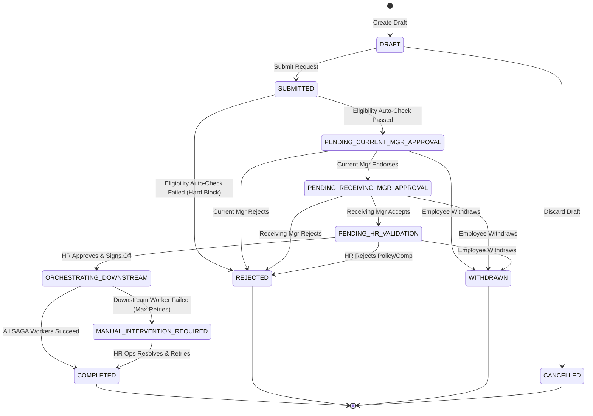

# Deliverable 2: Feature Specification (.spec.md)
## Feature: One-Point Portal — Employee Internal Transfer Digital Journey (Composite Parent Spec)
- **Document ID**: `SPEC-EIT-001`
- **Methodology**: INT Specification-Driven Development/Delivery (SDD)
- **Status**: Released (v1.0.0)
- **Version**: 1.0.0
- **Authors**: SDD Technical Product Lead & System Architect
- **Decomposed Domain Sub-Specifications:**
  1. [Transfer Eligibility & Initiation (`transfer-eligibility-initiation`)](transfer-eligibility-initiation.spec.md): `AC-001` to `AC-005`
  2. [Transfer Multi-Tier Approval Governance & Withdrawal (`transfer-approval-workflow`)](transfer-approval-workflow.spec.md): `AC-006` to `AC-012`, `AC-021`, `AC-022`
  3. [Downstream SAGA Orchestration & Automated Provisioning (`transfer-saga-orchestration`)](transfer-saga-orchestration.spec.md): `AC-013` to `AC-019`
  4. [Transfer Cryptographic Audit, Security Guards & Live Portal (`transfer-audit-security-portal`)](transfer-audit-security-portal.spec.md): `AC-020`, `AC-023` to `AC-025`

---

## 1. Feature Overview & Scope

The **Employee Internal Transfer Module** enables an authenticated employee to discover and initiate an internal transfer request across departments, locations, and roles within the enterprise. The system enforces multi-tier governance (Current Line Manager $\rightarrow$ Receiving Line Manager $\rightarrow$ HR Operations), executes automated eligibility pre-checks, provides a live visual status timeline, and orchestrates downstream enterprise provisioning across Core HRIS, Payroll, IT IAM, and Facilities CAFM.


---

## 2. Finite State Machine (FSM) Specification



### State Definitions Table
| State Identifier | Description | Allowed Roles to Mutate | Permitted Next States |
| :--- | :--- | :--- | :--- |
| `DRAFT` | Request initiated but not formally submitted. Only visible to initiator. | Employee | `SUBMITTED`, `CANCELLED` |
| `SUBMITTED` | Submitted; pre-flight validation rules executed synchronously. | System | `PENDING_CURRENT_MGR_APPROVAL`, `REJECTED` |
| `PENDING_CURRENT_MGR_APPROVAL` | Awaiting current line manager review and handover comments. | Current Manager, Employee (Withdraw) | `PENDING_RECEIVING_MGR_APPROVAL`, `REJECTED`, `WITHDRAWN` |
| `PENDING_RECEIVING_MGR_APPROVAL`| Awaiting receiving department manager headcount confirmation. | Receiving Manager, Employee (Withdraw) | `PENDING_HR_VALIDATION`, `REJECTED`, `WITHDRAWN` |
| `PENDING_HR_VALIDATION` | Awaiting HR Mobility Partner eligibility & compensation review. | HR Partner, Employee (Withdraw) | `ORCHESTRATING_DOWNSTREAM`, `REJECTED`, `WITHDRAWN` |
| `ORCHESTRATING_DOWNSTREAM` | HR approved; distributed SAGA executing downstream provisioning. | System / SAGA Coordinator | `COMPLETED`, `MANUAL_INTERVENTION_REQUIRED` |
| `MANUAL_INTERVENTION_REQUIRED` | One or more downstream integrations failed after 5 retries. | HR Ops Admin / SAGA Admin | `ORCHESTRATING_DOWNSTREAM` (Retry), `COMPLETED` |
| `COMPLETED` | Terminal success. All records synced, Day 1 dossier generated. | None (Terminal) | None |
| `REJECTED` | Terminal rejection by stakeholder or hard rule failure. | None (Terminal) | None |
| `WITHDRAWN` | Terminal withdrawal initiated by employee prior to HR sign-off. | None (Terminal) | None |
| `CANCELLED` | Draft discarded by employee. | None (Terminal) | None |

---

## 3. Individually Identifiable Acceptance Criteria (AC-001 to AC-025)

### Group A: Initiation, Pre-flight & Form Validation

#### `AC-001`: Transfer Initiation Form Pre-population
```gherkin
Feature: Employee Transfer Initiation
  Scenario: Authenticated employee navigates to transfer initiation
    Given an authenticated employee "EMP-1042" with 18 months tenure in "Cloud Infrastructure" at "London HQ"
    When the employee opens the Internal Transfer Initiation page
    Then the system pre-populates:
      | Field                  | Value                       | State     |
      | Current Employee ID    | EMP-1042                    | Read-Only |
      | Current Department     | Cloud Infrastructure        | Read-Only |
      | Current Office         | London HQ                   | Read-Only |
      | Current Line Manager   | Alex Wong (MGR-2019)        | Read-Only |
      | Current Service Tenure | 18 Months                   | Read-Only |
    And displays active selection dropdowns for "Target Business Unit", "Target Location", "Target Role", and "Effective Date".
```

#### `AC-002`: Target Effective Date Notice Period Validation
```gherkin
Feature: Notice Period Validation
  Scenario: Employee selects an effective date less than 30 days from today
    Given today's date is "2026-09-01"
    When the employee selects target effective date "2026-09-15" (14 days ahead)
    Then the system rejects the submission with validation error "ERR_NOTICE_PERIOD_VIOLATION"
    And displays user message "Target effective date must be at least 30 calendar days from submission (Earliest allowed: 2026-10-01)."
```

#### `AC-003`: Duplicate Active Transfer Prevention
```gherkin
Feature: Active Transfer Singleton Constraint
  Scenario: Employee attempts to submit when another request is already in progress
    Given employee "EMP-1042" already has transfer request "TRF-9001" in status "PENDING_CURRENT_MGR_APPROVAL"
    When the employee submits a new transfer request
    Then the system blocks submission with HTTP 409 Conflict
    And returns error code "ERR_DUPLICATE_ACTIVE_TRANSFER"
    And displays "You already have an active transfer request (TRF-9001). You must withdraw or complete it first."
```

#### `AC-004`: Automatic Pre-flight Eligibility Hard Block
```gherkin
Feature: Eligibility Pre-flight
  Scenario: Employee with active disciplinary warning attempts submission
    Given employee "EMP-5002" has an active Disciplinary PIP record recorded within 90 days
    When the employee attempts to submit a transfer request
    Then the system halts submission with status "REJECTED"
    And records rejection reason "Eligibility criteria not satisfied: Active Disciplinary Action on record."
    And logs security audit event "TRANSFER_PREFLIGHT_BLOCKED".
```

#### `AC-005`: Saving and Resuming Draft Requests
```gherkin
Feature: Transfer Request Drafting
  Scenario: Employee saves incomplete transfer form as draft
    Given employee "EMP-1042" fills partial fields (Target BU: "Product Operations", Target Location: "New York")
    When the employee clicks "Save Draft"
    Then the system persists the request in state "DRAFT" with unique ID "TRF-DRAFT-XXXX"
    And does NOT dispatch any notification to the current line manager
    And allows the employee to edit and submit at a later time.
```

---

### Group B: Current Manager Review & Handover

#### `AC-006`: Current Manager Notification & Inbox Action
```gherkin
Feature: Current Manager Endorsement
  Scenario: Request transitions to PENDING_CURRENT_MGR_APPROVAL
    Given transfer request "TRF-1001" is submitted by employee "EMP-1042"
    When the state transitions to "PENDING_CURRENT_MGR_APPROVAL"
    Then the system creates an actionable task item in manager "MGR-2019" dashboard
    And sends an email notification with deep-link to the transfer review page
    And starts an SLA timer of 5 business days.
```

#### `AC-007`: Current Manager Approval with Handover Notes
```gherkin
Feature: Current Manager Approval
  Scenario: Current Manager reviews and endorses transfer
    Given request "TRF-1001" is in "PENDING_CURRENT_MGR_APPROVAL"
    And line manager "MGR-2019" is authenticated
    When the manager inputs handover notes "Transition project ownership to Dev Team B by Oct 15"
    And clicks "Endorse Transfer"
    Then the system transitions the request to "PENDING_RECEIVING_MGR_APPROVAL"
    And updates the audit ledger with action "CURRENT_MGR_APPROVED" by "MGR-2019"
    And notifies the Receiving Line Manager.
```

#### `AC-008`: Current Manager Rejection with Mandatory Reason
```gherkin
Feature: Current Manager Rejection
  Scenario: Current Manager rejects transfer without providing remarks
    Given request "TRF-1001" is in "PENDING_CURRENT_MGR_APPROVAL"
    When manager "MGR-2019" clicks "Reject Transfer" with empty rationale
    Then the system blocks the action with validation error "ERR_MANDATORY_REJECTION_REASON"
    And requires at least 20 characters of justification before confirming rejection.
```

---

### Group C: Receiving Manager Acceptance

#### `AC-009`: Receiving Manager Headcount & Role Verification
```gherkin
Feature: Receiving Manager Approval
  Scenario: Receiving Manager approves incoming candidate
    Given request "TRF-1001" is in "PENDING_RECEIVING_MGR_APPROVAL"
    And receiving manager "MGR-3088" reviews candidate profile and open requisition "REQ-NY-77"
    When manager "MGR-3088" selects "Confirm Headcount Allocation" and clicks "Accept Candidate"
    Then the system transitions the request to "PENDING_HR_VALIDATION"
    And records audit trail event "RECEIVING_MGR_APPROVED" by "MGR-3088"
    And notifies HR Mobility Operations.
```

#### `AC-010`: Receiving Manager Rejection
```gherkin
Feature: Receiving Manager Rejection
  Scenario: Target department freezes headcount
    Given request "TRF-1001" is in "PENDING_RECEIVING_MGR_APPROVAL"
    When receiving manager "MGR-3088" rejects the request with reason "Requisition REQ-NY-77 frozen due to budget reallocation"
    Then the request state immediately updates to "REJECTED"
    And an automated notification is dispatched to employee "EMP-1042" and current manager "MGR-2019".
```

---

### Group D: HR Mobility & Compliance Validation

#### `AC-011`: Automated HR Eligibility Checklist Verification
```gherkin
Feature: HR Eligibility Verification
  Scenario: HR Partner opens pending validation view
    Given request "TRF-1001" is in "PENDING_HR_VALIDATION"
    When HR Partner "HR-4011" opens the compliance review panel
    Then the system displays automated check scores:
      | Check Item             | Criteria                  | Evaluated Result |
      | Service Tenure         | >= 12 Months              | PASS (18 Months) |
      | Performance Appraisal  | Rating >= Level 3 (Meets) | PASS (Level 4.2) |
      | Disciplinary Record    | No active PIP in 6 months | PASS (Clear)     |
      | Salary Band Fit        | Within Grade 8 Bounds     | PASS ($120k-$145k)|
      | Right to Work / Visa   | Target Jurisdiction US    | PASS (US Citizen)|
```

#### `AC-012`: HR Final Sign-off & Trigger of Downstream SAGA
```gherkin
Feature: HR Final Sign-off
  Scenario: HR Partner signs off on transfer
    Given all eligibility checks are in "PASS" status for request "TRF-1001"
    When HR Partner "HR-4011" confirms salary grade and clicks "Approve & Execute Transfer"
    Then the system transitions the request to "ORCHESTRATING_DOWNSTREAM"
    And writes an outbox message to trigger asynchronous downstream SAGA orchestration
    And records audit event "HR_FINAL_APPROVAL_GRANTED" with digital signature hash.
```

---

### Group E: Downstream SAGA Orchestration & Provisioning

#### `AC-013`: Core HRIS Employee Record Sync
```gherkin
Feature: SAGA HRIS Worker
  Scenario: HRIS worker receives transfer event
    Given request "TRF-1001" entered "ORCHESTRATING_DOWNSTREAM"
    When the HRIS SAGA worker processes the event with idempotency key "TRF-1001-HRIS-v1"
    Then it updates the Core HRIS database:
      | Field             | New Value              |
      | DepartmentCode    | DEP-PROD-NY            |
      | LocationCode      | LOC-NYC-01             |
      | ManagerEmployeeId | EMP-3088               |
      | EffectiveDate     | 2026-10-15             |
    And marks the HRIS step as "SUCCESS" in the orchestration ledger.
```

#### `AC-014`: Payroll Cost Center & Tax Jurisdiction Update
```gherkin
Feature: SAGA Payroll Worker
  Scenario: Payroll worker executes cost-center remapping
    Given request "TRF-1001" has target location "New York, USA"
    When the Payroll SAGA worker executes with idempotency key "TRF-1001-PAY-v1"
    Then it re-assigns Cost Center from "CC-UK-ENG-101" to "CC-US-PRD-204"
    And updates the state tax withholding profile to "US-NY"
    And marks Payroll step as "SUCCESS".
```

#### `AC-015`: IT IAM Role Provisioning & Deprovisioning Schedule
```gherkin
Feature: SAGA IT Provisioning Worker
  Scenario: IT IAM worker grants new department entitlements
    Given request "TRF-1001" transitions to target department "Product Operations"
    When the IT SAGA worker executes with idempotency key "TRF-1001-IT-v1"
    Then it schedules revocation of legacy group "sec-eng-cloud-admin" for "2026-10-14T23:59:59Z"
    And immediately provisions new group "sec-prod-ops-standard"
    And creates a ServiceNow equipment ticket "IT-REQ-88321" for New York laptop dock setup
    And marks IT step as "SUCCESS".
```

#### `AC-016`: Facilities CAFM Desk & Badge Assignment
```gherkin
Feature: SAGA Facilities Worker
  Scenario: Facilities worker allocates workstation in New York office
    Given request "TRF-1001" target office is "LOC-NYC-01"
    When the Facilities SAGA worker executes with idempotency key "TRF-1001-FAC-v1"
    Then it creates badge activation profile for building "NYC-Tower-A, Floor 14"
    And reserves workstation "DESK-NYC-14-082" effective "2026-10-15"
    And marks Facilities step as "SUCCESS".
```

#### `AC-017`: SAGA Completion & Transition Day Dashboard
```gherkin
Feature: SAGA Orchestration Completion
  Scenario: All four downstream workers complete successfully
    Given HRIS, Payroll, IT, and Facilities workers have all acknowledged "SUCCESS"
    When the SAGA coordinator evaluates workflow state
    Then it transitions request "TRF-1001" to "COMPLETED"
    And dispatches the "Transfer Handover Dossier" email to all stakeholders
    And renders the Day 1 Welcome Dashboard for employee "EMP-1042".
```

#### `AC-018`: SAGA Fault Tolerance & Retry Handling
```gherkin
Feature: SAGA Resiliency & Retry
  Scenario: IT Service API experiences temporary HTTP 503 error
    Given request "TRF-1001" is in "ORCHESTRATING_DOWNSTREAM"
    When the IT worker encounters HTTP 503 on attempt 1
    Then the worker executes exponential backoff retry (1s, 2s, 4s, 8s, 16s)
    And succeeds on attempt 3 without corrupting already completed HRIS or Payroll steps.
```

#### `AC-019`: SAGA Critical Failure Escalation
```gherkin
Feature: SAGA Manual Intervention Escalation
  Scenario: Facilities CAFM system remains unreachable after 5 retries
    Given Facilities worker exhausts all 5 retry attempts
    When failure persists
    Then the system transitions request to "MANUAL_INTERVENTION_REQUIRED"
    And alerts the HR Operations Command Center with error payload and idempotency recovery token.
```

---

### Group F: Employee Self-Service, Visibility & Withdrawal

#### `AC-020`: Real-time Multi-Stakeholder Progress Tracker
```gherkin
Feature: Visual Status Tracker
  Scenario: Employee views in-flight transfer request
    Given request "TRF-1001" is in "PENDING_RECEIVING_MGR_APPROVAL"
    When employee "EMP-1042" opens the One-Point Portal tracker
    Then the UI renders a visual progress stepper:
      | Step Name             | Visual State | Subtitle / Responsible Party |
      | 1. Initiation         | Completed (✓)| Submitted on 2026-09-01      |
      | 2. Current Manager    | Completed (✓)| Endorsed by Alex Wong        |
      | 3. Receiving Manager  | In-Progress ▶| Pending with Sarah Jenkins   |
      | 4. HR Validation      | Upcoming (○) | Assigned to HR Operations    |
      | 5. Downstream Sync    | Upcoming (○) | Automated (IT, Pay, Fac)     |
      | 6. Final Handover     | Upcoming (○) | Ready on Effective Date      |
```

#### `AC-021`: Employee Voluntary Withdrawal
```gherkin
Feature: Request Withdrawal
  Scenario: Employee withdraws request before HR final sign-off
    Given request "TRF-1001" is in "PENDING_RECEIVING_MGR_APPROVAL"
    When employee "EMP-1042" clicks "Withdraw Request" and confirms modal prompt
    Then the system updates state to "WITHDRAWN"
    And cancels all pending manager action items in work queues
    And sends informational notices to both line managers.
```

#### `AC-022`: Withdrawal Prohibited After HR Approval
```gherkin
Feature: Withdrawal Guard Rule
  Scenario: Employee attempts withdrawal while downstream provisioning is active
    Given request "TRF-1001" is in state "ORCHESTRATING_DOWNSTREAM" or "COMPLETED"
    When employee "EMP-1042" attempts to trigger withdrawal action
    Then the system rejects the action with HTTP 403 Forbidden
    And returns error "ERR_WITHDRAWAL_WINDOW_CLOSED" ("Cannot self-withdraw after HR approval. Contact HR Operations for cancellation.").
```

---

### Group G: Security, RBAC & Auditability

#### `AC-023`: Object-Level Access Control (BOLA / IDOR Prevention)
```gherkin
Feature: Security Access Control
  Scenario: Unauthorized employee attempts to view another peer's transfer details
    Given employee "EMP-9999" (unrelated peer) is authenticated
    When they attempt to access `GET /api/v1/transfers/TRF-1001`
    Then the API rejects the request with HTTP 403 Forbidden
    And records a security threat alert in the SOC audit log.
```

#### `AC-024`: Tamper-Evident Cryptographic Audit Trail
```gherkin
Feature: Audit Ledger Hash Integrity
  Scenario: Any state transition occurs on a transfer request
    Given transfer request "TRF-1001" undergoes transition from state $S_n$ to $S_{n+1}$
    When the audit log entry $E_k$ is written
    Then $E_k$ contains:
      | Property      | Requirement                                                |
      | Entry ID      | Monotonically incrementing UUIDv7                          |
      | Timestamp     | ISO 8601 UTC timestamp                                     |
      | Actor ID      | Authenticated user ID or SYSTEM                            |
      | Action        | Transition action code (e.g. "CURRENT_MGR_APPROVED")       |
      | Previous Hash | SHA-256 hash of entry $E_{k-1}$                           |
      | Current Hash  | SHA-256(EntryID + Timestamp + Actor + Action + PrevHash)   |
    And any tampering with intermediate database records causes hash-chain verification to fail.
```

#### `AC-025`: Optimistic Concurrency Race Condition Guard
```gherkin
Feature: Concurrent Action Prevention
  Scenario: Simultaneous manager approval and employee withdrawal
    Given request "TRF-1001" is at version 2 in "PENDING_CURRENT_MGR_APPROVAL"
    When Manager submits approval with expected version 2
    And Employee simultaneously submits withdrawal with expected version 2
    Then one request commits successfully advancing version to 3
    And the second request is rejected with HTTP 409 Conflict ("Record has been modified by another transaction. Please refresh.").
```

---

## 4. UI & Usability Specifications

### 4.1 Visual Theme & Layout Standard
- **Design Language**: One-Point Modern Enterprise Glassmorphism (Deep Slate `#0f172a`, Indigo `#6366f1`, Emerald `#10b981`, Amber `#f59e0b`, Rose `#f43f5e`).
- **Responsive Layout**: Desktop (1440px+), Tablet (768px - 1024px), Mobile Viewport (375px+).
- **Accessibility**: 100% WCAG 2.1 Level AA compliant; full keyboard tab navigation; ARIA labels on all live progress timeline nodes.

### 4.2 Interactive Components
1. **Interactive Persona Switcher**: Top-bar test harness toggle between Employee (`Jane Doe`), Current Manager (`Alex Wong`), Receiving Manager (`Sarah Jenkins`), and HR Partner (`Michael Scott`).
2. **Transfer Initiation Wizard**: Dynamic multi-select for BU $\rightarrow$ Office Location $\rightarrow$ Role with live notice-period date calculator.
3. **Live Animated Journey Tracker**: Glowing interactive nodes showing timestamps, responsible actor, and pending SLAs.
4. **Stakeholder Action Card**: Clean contextual action dialogs (Approve / Reject / Counter-Date) with mandatory validation notes.
5. **Real-time Cryptographic Audit Trail Inspector**: Expandable drawer showing immutable hash chain of all system events.

---

## 5. API Error Code Taxonomy

| Error Code | HTTP Status | Error Message / Description |
| :--- | :--- | :--- |
| `ERR_UNAUTHENTICATED` | 401 | Missing or invalid authentication token. |
| `ERR_FORBIDDEN_ROLE` | 403 | User does not possess the requisite RBAC role for this action. |
| `ERR_FORBIDDEN_OBJECT_ACCESS`| 403 | User is not an authorized stakeholder for this transfer entity (BOLA guard). |
| `ERR_NOT_FOUND` | 404 | Transfer request with specified ID does not exist. |
| `ERR_DUPLICATE_ACTIVE_TRANSFER`| 409 | Initiator already has an open in-flight transfer request. |
| `ERR_CONCURRENT_MUTATION` | 409 | Optimistic lock failure; entity was mutated by concurrent actor. |
| `ERR_INVALID_STATE_TRANSITION` | 422 | Requested transition is illegal from the current FSM state. |
| `ERR_NOTICE_PERIOD_VIOLATION` | 422 | Effective date does not meet minimum 30-day notice requirement. |
| `ERR_MANDATORY_REJECTION_REASON`| 422 | Rejection requires minimum 20 characters of justification. |
| `ERR_DOWNSTREAM_INTEGRATION`| 502 | Downstream SAGA worker failed to connect to enterprise adapter. |
