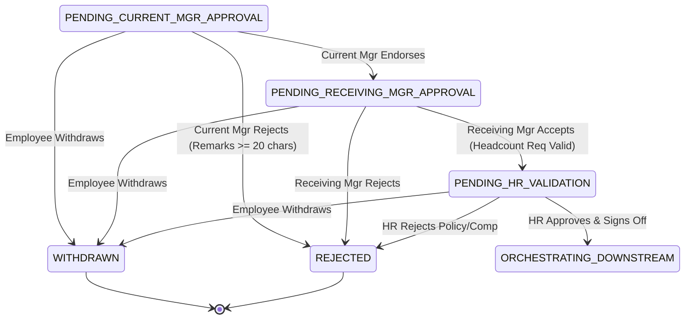

# Spec: Transfer Multi-Tier Approval Governance & Withdrawal

## Spec ID
`transfer-approval-workflow`

## Status
Released (v1.0.0)

## Roles & Assignments
- **Developer:** Aniruddha Goswami (`aniruddha.goswami@intglobal.com`)
- **Gate 1 Reviewer(s):** Supratim Jetty (`supratim.jetty@intglobal.com`)
- **Gate 2 Reviewer(s):** Supratim Jetty (`supratim.jetty@intglobal.com`)


## Linked BRD
- Baseline: `.ai-context/BRD.md`
- Requirements: `BRD-FR-005`, `BRD-FR-006`, `BRD-FR-007`, `BRD-FR-008`, `BRD-FR-009`
- Business Rules: `BR-005`, `BR-007`, `BR-008`, `BR-009`, `BR-010`, `BR-011`, `BR-013`

## Gate Approvals & History
| Gate | Approver Name | Approver Email/ID | Date/Time | Outcome | Approval Comment / Summary |
| :--- | :--- | :--- | :--- | :---: | :--- |
| Gate 1 (Spec Review) | Supratim Jetty | `supratim.jetty@intglobal.com` | 2026-09-14 14:15:00 | **Approved** | "Approval sequence FSM, withdrawal boundaries, and mandatory rejection schema approved." |
| Gate 2 (Code Review) | Supratim Jetty | `supratim.jetty@intglobal.com` | 2026-09-14 17:35:00 | **Approved** | "All state machine transitions, rejection validations, and withdrawal guards passed 100%." |

---

## Intent
Enforce a strictly ordered, multi-tier approval governance pipeline across Current Line Manager, Receiving Line Manager, and HR Mobility Operations. Guarantee transition handover notes, 5-day review SLA auto-escalation, mandatory rejection justifications ($\ge 20$ characters), and employee voluntary withdrawal rights strictly bounded prior to HR sign-off.

---

## Context
- **Parent Spec:** `.ai-context/specs/employee-internal-transfer.spec.md`
- **Architecture Reference:** `.ai-context/architecture.md §2.2 (TransferFSMService)`
- **Implementation Modules:**
  - State Machine: `app/src/services/state-machine.service.ts`
  - Transfer Coordinator: `app/src/services/transfer.service.ts`
  - Routes: `app/src/routes/transfer.routes.ts`
- **Test Suite:** `app/tests/unit/state-machine.test.ts`, `app/tests/integration/transfer-api.test.ts`

---

## Finite State Machine Sub-Flow



---

## API Contracts

### `APV.API01` — `POST /api/v1/transfers/:id/approve/current-manager`
Endorsement by the current line manager with transition handover instructions.

**Request Payload:**
```json
{
  "handoverNotes": "Transition project ownership to Dev Team B by Oct 15",
  "expectedVersion": 1
}
```

**Success Response (`200 OK`):**
```json
{
  "success": true,
  "data": {
    "id": "TRF-1001",
    "state": "PENDING_RECEIVING_MGR_APPROVAL",
    "version": 2,
    "updatedAt": "2026-09-02T14:30:00.000Z"
  }
}
```

### `APV.API02` — `POST /api/v1/transfers/:id/approve/receiving-manager`
Acceptance by the prospective receiving manager confirming requisition code.

**Request Payload:**
```json
{
  "requisitionCode": "REQ-NY-77",
  "comments": "Confirmed open headcount and accepted candidate effective Oct 15.",
  "expectedVersion": 2
}
```

**Success Response (`200 OK`):**
```json
{
  "success": true,
  "data": {
    "id": "TRF-1001",
    "state": "PENDING_HR_VALIDATION",
    "version": 3,
    "updatedAt": "2026-09-03T11:15:00.000Z"
  }
}
```

### `APV.API03` — `POST /api/v1/transfers/:id/approve/hr`
Final authorization by HR Mobility Partner triggering downstream orchestration.

**Request Payload:**
```json
{
  "salaryGradeConfirmed": "Grade 8",
  "crossEntityTaxConfirmed": true,
  "expectedVersion": 3
}
```

**Success Response (`200 OK`):**
```json
{
  "success": true,
  "data": {
    "id": "TRF-1001",
    "state": "ORCHESTRATING_DOWNSTREAM",
    "version": 4,
    "updatedAt": "2026-09-04T09:00:00.000Z"
  }
}
```

### `APV.API04` — `POST /api/v1/transfers/:id/reject`
Rejection by any stakeholder terminating the request into `REJECTED`.

**Request Payload:**
```json
{
  "reason": "Requisition REQ-NY-77 frozen due to corporate budget reallocation.",
  "expectedVersion": 2
}
```

**Success Response (`200 OK`):**
```json
{
  "success": true,
  "data": {
    "id": "TRF-1001",
    "state": "REJECTED",
    "version": 3,
    "rejectionReason": "Requisition REQ-NY-77 frozen due to corporate budget reallocation."
  }
}
```

**Exceptions:**
| Code | Condition | Response Body |
| :--- | :--- | :--- |
| `400 Bad Request` | Rejection reason $< 20$ characters (`BR-009`) | `{ "error": "Rejection reason must be at least 20 characters", "code": "ERR_MANDATORY_REJECTION_REASON" }` |
| `403 Forbidden` | Non-stakeholder attempting approval | `{ "error": "User does not possess required role or ownership", "code": "ERR_FORBIDDEN_OBJECT_ACCESS" }` |
| `409 Conflict` | Version mismatch (optimistic lock failure) | `{ "error": "Concurrency conflict", "code": "ERR_CONCURRENT_MUTATION" }` |
| `422 Unprocessable` | Illegal transition sequence (`BR-007`) | `{ "error": "Invalid state transition", "code": "ERR_INVALID_STATE_TRANSITION" }` |

### `APV.API05` — `POST /api/v1/transfers/:id/withdraw`
Voluntary withdrawal by the initiator.

**Request Payload:**
```json
{
  "withdrawalReason": "Decided to accept long-term project commitment in current team.",
  "expectedVersion": 2
}
```

**Exceptions:**
| Code | Condition | Response Body |
| :--- | :--- | :--- |
| `403 Forbidden` | Initiator attempts withdrawal after HR approval (`BR-008`) | `{ "error": "Cannot withdraw after HR approval has initiated downstream orchestration", "code": "ERR_WITHDRAWAL_WINDOW_CLOSED" }` |

---

## Acceptance Criteria

### `AC-006`: Current Manager Notification & Inbox Action
```gherkin
Feature: Current Manager Endorsement
  Scenario: Request transitions to PENDING_CURRENT_MGR_APPROVAL
    Given transfer request "TRF-1001" is submitted by employee "EMP-1042"
    When the state transitions to "PENDING_CURRENT_MGR_APPROVAL"
    Then the system creates an actionable task item in manager "MGR-2019" dashboard
    And sends an email notification with deep-link to the transfer review page
    And starts an SLA timer of 5 business days.
```

### `AC-007`: Current Manager Approval with Handover Notes
```gherkin
Feature: Current Manager Approval
  Scenario: Current Manager reviews and endorses transfer
    Given request "TRF-1001" is in "PENDING_CURRENT_MGR_APPROVAL"
    And line manager "MGR-2019" is authenticated
    When the manager inputs handover notes "Transition project ownership to Dev Team B by Oct 15"
    And clicks "Endorse Transfer"
    Then the system transitions the request to "PENDING_RECEIVING_MGR_APPROVAL"
    And updates the audit ledger with action "CURRENT_MGR_APPROVED" by "MGR-2019"
    And notifies the Receiving Line Manager.
```

### `AC-008`: Current Manager Rejection with Mandatory Reason
```gherkin
Feature: Current Manager Rejection
  Scenario: Current Manager rejects transfer without providing remarks
    Given request "TRF-1001" is in "PENDING_CURRENT_MGR_APPROVAL"
    When manager "MGR-2019" clicks "Reject Transfer" with empty rationale
    Then the system blocks the action with validation error "ERR_MANDATORY_REJECTION_REASON"
    And requires at least 20 characters of justification before confirming rejection.
```

### `AC-009`: Receiving Manager Headcount & Role Verification
```gherkin
Feature: Receiving Manager Approval
  Scenario: Receiving Manager approves incoming candidate
    Given request "TRF-1001" is in "PENDING_RECEIVING_MGR_APPROVAL"
    And receiving manager "MGR-3088" reviews candidate profile and open requisition "REQ-NY-77"
    When manager "MGR-3088" selects "Confirm Headcount Allocation" and clicks "Accept Candidate"
    Then the system transitions the request to "PENDING_HR_VALIDATION"
    And records audit trail event "RECEIVING_MGR_APPROVED" by "MGR-3088"
    And notifies HR Mobility Operations.
```

### `AC-010`: Receiving Manager Rejection
```gherkin
Feature: Receiving Manager Rejection
  Scenario: Target department freezes headcount
    Given request "TRF-1001" is in "PENDING_RECEIVING_MGR_APPROVAL"
    When receiving manager "MGR-3088" rejects the request with reason "Requisition REQ-NY-77 frozen due to budget reallocation"
    Then the request state immediately updates to "REJECTED"
    And an automated notification is dispatched to employee "EMP-1042" and current manager "MGR-2019".
```

### `AC-011`: Automated HR Eligibility Checklist Verification
```gherkin
Feature: HR Eligibility Verification
  Scenario: HR Partner opens pending validation view
    Given request "TRF-1001" is in "PENDING_HR_VALIDATION"
    When HR Partner "HR-4011" opens the compliance review panel
    Then the system displays automated check scores:
      | Check Item             | Criteria                  | Evaluated Result |
      | Service Tenure         | >= 12 Months              | PASS (18 Months) |
      | Performance Appraisal  | Rating >= Level 3 (Meets) | PASS (Level 4.2) |
      | Disciplinary Record    | No active PIP in 6 months | PASS (Clear)     |
      | Salary Band Fit        | Within Grade 8 Bounds     | PASS ($120k-$145k)|
      | Right to Work / Visa   | Target Jurisdiction US    | PASS (US Citizen)|
```

### `AC-012`: HR Final Sign-off & Trigger of Downstream SAGA
```gherkin
Feature: HR Final Sign-off
  Scenario: HR Partner signs off on transfer
    Given all eligibility checks are in "PASS" status for request "TRF-1001"
    When HR Partner "HR-4011" confirms salary grade and clicks "Approve & Execute Transfer"
    Then the system transitions the request to "ORCHESTRATING_DOWNSTREAM"
    And writes an outbox message to trigger asynchronous downstream SAGA orchestration
    And records audit event "HR_FINAL_APPROVAL_GRANTED" with digital signature hash.
```

### `AC-021`: Employee Voluntary Withdrawal
```gherkin
Feature: Request Withdrawal
  Scenario: Employee withdraws request before HR final sign-off
    Given request "TRF-1001" is in "PENDING_RECEIVING_MGR_APPROVAL"
    When employee "EMP-1042" clicks "Withdraw Request" and confirms modal prompt
    Then the system updates state to "WITHDRAWN"
    And cancels all pending manager action items in work queues
    And sends informational notices to both line managers.
```

### `AC-022`: Withdrawal Prohibited After HR Approval
```gherkin
Feature: Withdrawal Guard Rule
  Scenario: Employee attempts withdrawal while downstream provisioning is active
    Given request "TRF-1001" is in state "ORCHESTRATING_DOWNSTREAM" or "COMPLETED"
    When employee "EMP-1042" attempts to trigger withdrawal action
    Then the system rejects the action with HTTP 403 Forbidden
    And returns error "ERR_WITHDRAWAL_WINDOW_CLOSED" ("Cannot self-withdraw after HR approval. Contact HR Operations for cancellation.").
```

---

## Unit & Integration Test Cases

| Test ID | Maps to AC | Scenario | Expected Outcome | Location |
| :--- | :--- | :--- | :--- | :--- |
| `UT-APV-001` | `AC-007` | Current manager approval transition | Next state `PENDING_RECEIVING_MGR_APPROVAL` | `tests/unit/state-machine.test.ts` |
| `UT-APV-002` | `AC-009` | Receiving manager approval transition | Next state `PENDING_HR_VALIDATION` | `tests/unit/state-machine.test.ts` |
| `UT-APV-003` | `AC-012` | HR partner approval transition | Next state `ORCHESTRATING_DOWNSTREAM` | `tests/unit/state-machine.test.ts` |
| `UT-APV-004` | `AC-007` | Illegal jump from Mgr1 directly to Completed | Throws `ERR_INVALID_STATE_TRANSITION` | `tests/unit/state-machine.test.ts` |
| `UT-APV-005` | `AC-008` | Mutation attempt on terminal `REJECTED` | Mutation blocked | `tests/unit/state-machine.test.ts` |
| `IT-APV-001` | `AC-008` | Reject with remarks $< 20$ chars | HTTP 422 `ERR_MANDATORY_REJECTION_REASON` | `tests/integration/transfer-api.test.ts` |
| `IT-APV-002` | `AC-021` | Voluntary withdrawal while pending Mgr2 | Transitions to `WITHDRAWN` | `tests/integration/transfer-api.test.ts` |
| `IT-APV-003` | `AC-022` | Withdrawal attempt on `COMPLETED` | HTTP 403 `ERR_WITHDRAWAL_WINDOW_CLOSED` | `tests/integration/transfer-api.test.ts` |

---

## Explicitly Out of Scope
- Direct manager salary negotiation or merit budget changes.
- Counter-offer retention interview workflow.

## Non-Functional Constraints (from constitution.md)
- Turnaround SLA target $\le 5$ business days.
- State machine transition execution latency $< 10$ms in-process.
