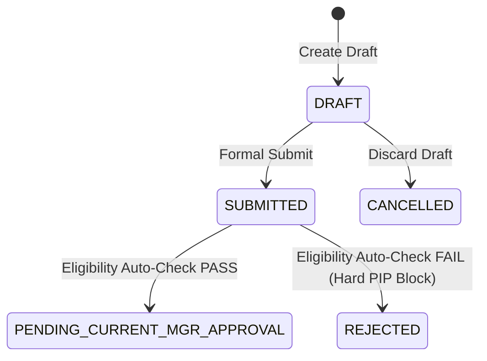

# Spec: Transfer Eligibility & Initiation

## Spec ID
`transfer-eligibility-initiation`

## Status
Released (v1.0.0)

## Roles & Assignments
- **Developer:** Aniruddha Goswami (`aniruddha.goswami@intglobal.com`)
- **Gate 1 Reviewer(s):** Supratim Jetty (`supratim.jetty@intglobal.com`)
- **Gate 2 Reviewer(s):** Supratim Jetty (`supratim.jetty@intglobal.com`)


## Linked BRD
- Baseline: `.ai-context/BRD.md`
- Requirements: `BRD-FR-001`, `BRD-FR-002`, `BRD-FR-003`, `BRD-FR-004`
- Business Rules: `BR-001`, `BR-002`, `BR-003`, `BR-004`, `BR-006`

## Gate Approvals & History
| Gate | Approver Name | Approver Email/ID | Date/Time | Outcome | Approval Comment / Summary |
| :--- | :--- | :--- | :--- | :---: | :--- |
| Gate 1 (Spec Review) | Supratim Jetty | `supratim.jetty@intglobal.com` | 2026-09-14 14:00:00 | **Approved** | "Spec approved; eligibility criteria, Gherkin ACs, and API schema fully baselined." |
| Gate 2 (Code Review) | Supratim Jetty | `supratim.jetty@intglobal.com` | 2026-09-14 17:30:00 | **Approved** | "100% test pass rate across eligibility unit tests and initiation integration suite." |

---

## Intent
Enable authenticated employees to review their auto-populated organizational profile, run instantaneous pre-flight eligibility checks against core HR tenure, performance, and disciplinary standards, save private draft proposals, and formally initiate internal transfer requests with guaranteed 30-day notice and singleton active-request constraints.

---

## Context
- **Parent Spec:** `.ai-context/specs/employee-internal-transfer.spec.md`
- **Architecture Reference:** `.ai-context/architecture.md §2.1 (API Gateway), §2.2 (EligibilityService)`
- **Implementation Modules:**
  - Engine: `app/src/services/eligibility.service.ts`
  - Routes: `app/src/routes/transfer.routes.ts`
  - Schema: `app/src/schemas/transfer.schema.ts`
  - Presentation: `app/public/index.html`
- **Test Suite:** `app/tests/unit/eligibility.test.ts`, `app/tests/integration/transfer-api.test.ts`

---

## Finite State Machine Sub-Flow



---

## API Contracts

### `ELI.API01` — `GET /api/v1/transfers/meta/options`
Retrieves available enterprise departments, office locations, and target job roles for the transfer selection wizard.

**Request:** None (Authenticated Session JWT)

**Success Response (`200 OK`):**
```json
{
  "success": true,
  "data": {
    "departments": [
      { "id": "DEP-ENG", "name": "Cloud Infrastructure" },
      { "id": "DEP-PROD-NY", "name": "Product Operations" },
      { "id": "DEP-DATA", "name": "Enterprise Analytics" }
    ],
    "locations": [
      { "id": "LOC-LON-01", "name": "London HQ", "country": "UK" },
      { "id": "LOC-NYC-01", "name": "New York", "country": "USA" }
    ],
    "roles": [
      { "id": "ROLE-DEV-SR", "title": "Senior Cloud Engineer", "band": "Grade 8" },
      { "id": "ROLE-PROD-OPS", "title": "Product Operations Lead", "band": "Grade 8" }
    ]
  }
}
```

### `ELI.API02` — `GET /api/v1/transfers/preflight/eligibility`
Executes synchronous pre-flight rule validation for the authenticated employee.

**Request:** None (Evaluates JWT claims)

**Success Response (`200 OK`):**
```json
{
  "success": true,
  "data": {
    "isEligible": true,
    "employeeId": "EMP-1042",
    "checks": {
      "tenureMonths": 18,
      "tenurePassed": true,
      "performanceRating": 4.2,
      "performancePassed": true,
      "hasActivePip": false,
      "disciplinaryPassed": true
    },
    "blockers": []
  }
}
```

### `ELI.API03` — `POST /api/v1/transfers`
Creates a new draft or formally submits an internal transfer dossier.

**Request Payload:**
```json
{
  "targetDepartment": "Product Operations",
  "targetLocation": "New York",
  "targetRole": "Product Operations Lead",
  "targetDate": "2026-10-15",
  "reason": "Relocating to NY office to lead cross-functional product operations.",
  "isDraft": false
}
```

**Success Response (`201 Created`):**
```json
{
  "success": true,
  "data": {
    "id": "TRF-1001",
    "employeeId": "EMP-1042",
    "state": "PENDING_CURRENT_MGR_APPROVAL",
    "version": 1,
    "createdAt": "2026-09-01T10:00:00.000Z"
  }
}
```

**Exceptions:**
| Code | Condition | Response Body |
| :--- | :--- | :--- |
| `400 Bad Request` | Zod schema validation failure | `{ "error": "Invalid input payload", "details": [...] }` |
| `409 Conflict` | Active transfer already in-flight (`BR-006`) | `{ "error": "Employee already has an active transfer in flight", "code": "ERR_DUPLICATE_ACTIVE_TRANSFER" }` |
| `422 Unprocessable` | Notice period $< 30$ calendar days (`BR-004`) | `{ "error": "Target date must be at least 30 days from submission date", "code": "ERR_NOTICE_PERIOD_VIOLATION" }` |

---

## Acceptance Criteria

### `AC-001`: Transfer Initiation Form Pre-population
```gherkin
Feature: Employee Transfer Initiation
  Scenario: Authenticated employee navigates to transfer initiation
    Given an authenticated employee "EMP-1042" with 18 months tenure in "Cloud Infrastructure" at "London HQ"
    When the employee opens the Internal Transfer Initiation page
    Then the system pre-populates:
      | Field                  | Value                       | State     |
      | Current Employee ID    | EMP-1042                    | Read-Only |
      | Current Department     | Cloud Infrastructure        | Read-Only |
      | Current Office         | London HQ                   | Read-Only |
      | Current Line Manager   | Alex Wong (MGR-2019)        | Read-Only |
      | Current Service Tenure | 18 Months                   | Read-Only |
    And displays active selection dropdowns for "Target Business Unit", "Target Location", "Target Role", and "Effective Date".
```

### `AC-002`: Target Effective Date Notice Period Validation
```gherkin
Feature: Notice Period Validation
  Scenario: Employee selects an effective date less than 30 days from today
    Given today's date is "2026-09-01"
    When the employee selects target effective date "2026-09-15" (14 days ahead)
    Then the system rejects the submission with validation error "ERR_NOTICE_PERIOD_VIOLATION"
    And displays user message "Target effective date must be at least 30 calendar days from submission (Earliest allowed: 2026-10-01)."
```

### `AC-003`: Duplicate Active Transfer Prevention
```gherkin
Feature: Active Transfer Singleton Constraint
  Scenario: Employee attempts to submit when another request is already in progress
    Given employee "EMP-1042" already has transfer request "TRF-9001" in status "PENDING_CURRENT_MGR_APPROVAL"
    When the employee submits a new transfer request
    Then the system blocks submission with HTTP 409 Conflict
    And returns error code "ERR_DUPLICATE_ACTIVE_TRANSFER"
    And displays "You already have an active transfer request (TRF-9001). You must withdraw or complete it first."
```

### `AC-004`: Automatic Pre-flight Eligibility Hard Block
```gherkin
Feature: Eligibility Pre-flight
  Scenario: Employee with active disciplinary warning attempts submission
    Given employee "EMP-5002" has an active Disciplinary PIP record recorded within 90 days
    When the employee attempts to submit a transfer request
    Then the system halts submission with status "REJECTED"
    And records rejection reason "Eligibility criteria not satisfied: Active Disciplinary Action on record."
    And logs security audit event "TRANSFER_PREFLIGHT_BLOCKED".
```

### `AC-005`: Saving and Resuming Draft Requests
```gherkin
Feature: Transfer Request Drafting
  Scenario: Employee saves incomplete transfer form as draft
    Given employee "EMP-1042" fills partial fields (Target BU: "Product Operations", Target Location: "New York")
    When the employee clicks "Save Draft"
    Then the system persists the request in state "DRAFT" with unique ID "TRF-DRAFT-XXXX"
    And does NOT dispatch any notification to the current line manager
    And allows the employee to edit and submit at a later time.
```

---

## Unit & Integration Test Cases

| Test ID | Maps to AC | Scenario | Expected Outcome | Location |
| :--- | :--- | :--- | :--- | :--- |
| `UT-ELI-001` | `AC-001`, `AC-002` | Fully qualified employee with 45-day notice | Preflight status `PASS`, all rules pass | `tests/unit/eligibility.test.ts` |
| `UT-ELI-002` | `AC-004` | Employee with 8 months tenure (`BR-001`) | `tenurePassed == false`, preflight fail | `tests/unit/eligibility.test.ts` |
| `UT-ELI-003` | `AC-004` | Appraisal rating 2.5 (`BR-002`) | `performancePassed == false`, preflight fail | `tests/unit/eligibility.test.ts` |
| `UT-ELI-004` | `AC-004` | Active PIP flag present (`BR-003`) | `disciplinaryPassed == false`, hard block | `tests/unit/eligibility.test.ts` |
| `UT-ELI-005` | `AC-002` | Notice period 15 days ahead (`BR-004`) | `noticePeriodPassed == false` | `tests/unit/eligibility.test.ts` |
| `IT-ELI-001` | `AC-001` | `GET /api/v1/transfers/meta/options` | Returns departments, locations, and roles | `tests/integration/transfer-api.test.ts` |
| `IT-ELI-002` | `AC-003` | Submitting duplicate in-flight transfer | Rejection with HTTP 409 Conflict | `tests/integration/transfer-api.test.ts` |
| `IT-ELI-003` | `AC-002` | Submitting payload with $< 30$ days notice | HTTP 422 `ERR_NOTICE_PERIOD_VIOLATION` | `tests/integration/transfer-api.test.ts` |

---

## Explicitly Out of Scope
- External job board applications or interview requisition pipelines.
- Multi-currency relocation expense claim submissions (handled via global mobility expense portal).

## Non-Functional Constraints (from constitution.md)
- Pre-flight response latency $p95 < 200$ms.
- Full masking of employee performance notes in system logs.
