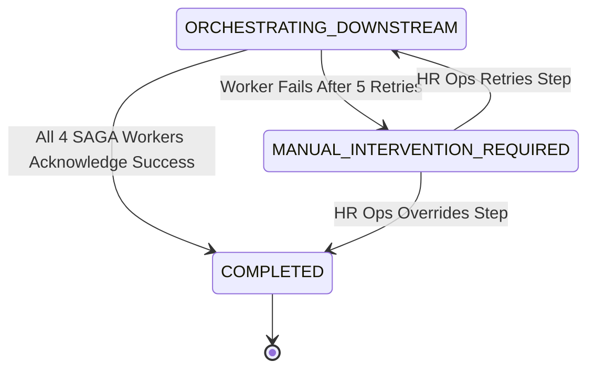

# Spec: Downstream SAGA Orchestration & Automated Provisioning

## Spec ID
`transfer-saga-orchestration`

## Status
Released (v1.0.0)

## Roles & Assignments
- **Developer:** Aniruddha Goswami (`aniruddha.goswami@intglobal.com`)
- **Gate 1 Reviewer(s):** Supratim Jetty (`supratim.jetty@intglobal.com`)
- **Gate 2 Reviewer(s):** Supratim Jetty (`supratim.jetty@intglobal.com`)


## Linked BRD
- Baseline: `.ai-context/BRD.md`
- Requirements: `BRD-FR-011`
- Business Rules: `BR-011`, `BR-012`, `BR-014`, `BR-015`
- Non-Functional Requirements: `BRD-NFR-005`

## Gate Approvals & History
| Gate | Approver Name | Approver Email/ID | Date/Time | Outcome | Approval Comment / Summary |
| :--- | :--- | :--- | :--- | :---: | :--- |
| Gate 1 (Spec Review) | Supratim Jetty | `supratim.jetty@intglobal.com` | 2026-09-14 14:30:00 | **Approved** | "SAGA Transactional Outbox pattern, idempotency keys, and retry backoff approved." |
| Gate 2 (Code Review) | Supratim Jetty | `supratim.jetty@intglobal.com` | 2026-09-14 17:40:00 | **Approved** | "Resilience tests passing: transient HTTP 503 recovery, 5-retry limit escalation verified." |

---

## Intent
Coordinate asynchronous downstream enterprise provisioning across 4 core adapters (Core HRIS, Global Payroll, IT IAM, Facilities CAFM) using a Transactional Outbox pattern. Enforce composite idempotency keys, resilient exponential backoff retries, dead-letter routing to manual intervention on critical failure, and Day 1 Welcome Handover Dossier synthesis upon completion.

---

## Context
- **Parent Spec:** `.ai-context/specs/employee-internal-transfer.spec.md`
- **Architecture Reference:** `.ai-context/architecture.md §2.3 (Distributed SAGA Orchestration), ADR-001`
- **Implementation Modules:**
  - Coordinator & Adapters: `app/src/services/orchestrator.service.ts`
  - Transactional Outbox: `app/src/services/outbox.service.ts`
- **Test Suite:** `app/tests/integration/saga-resilience.test.ts`

---

## Finite State Machine Sub-Flow



---

## Downstream Adapter Contracts & Outbox Pattern

### SAGA Provisioning Steps Matrix
| Adapter | Target System | Step Name | Idempotency Key Format | Failure Recovery |
| :--- | :--- | :--- | :--- | :--- |
| **HRIS** | Workday / SuccessFactors | `SYNC_HRIS_RECORD` | `<TransferID>-HRIS-v<Ver>` | Auto-retry up to 5 times |
| **Payroll** | SAP Payroll / ADP | `UPDATE_PAYROLL_TAX` | `<TransferID>-PAY-v<Ver>` | Auto-retry up to 5 times |
| **IT IAM** | Okta / Active Directory | `PROVISION_IT_IAM` | `<TransferID>-IT-v<Ver>` | Auto-retry up to 5 times |
| **Facilities** | CAFM / Badging System | `ASSIGN_FACILITIES_DESK` | `<TransferID>-FAC-v<Ver>` | Auto-retry up to 5 times |

### Idempotency Schema
All adapter invocations receive an `idempotencyKey`:
```typescript
interface SagaWorkerPayload {
  transferId: string;
  idempotencyKey: string; // e.g. "TRF-1001-IT-v1"
  employeeId: string;
  targetDepartment: string;
  targetLocation: string;
  targetRole: string;
  effectiveDate: string;
}
```

### Retry Algorithm
- **Max Attempts:** 5
- **Backoff Interval Formula:** $\text{WaitMs} = 1000 \times 2^{\text{attempt} - 1}$ (1s, 2s, 4s, 8s, 16s)
- **Terminal Escalation:** Upon exhausting 5 attempts, orchestrator halts auto-retry, transitions transfer entity to `MANUAL_INTERVENTION_REQUIRED`, and emits an operations alert.

---

## Acceptance Criteria

### `AC-013`: Core HRIS Employee Record Sync
```gherkin
Feature: SAGA HRIS Worker
  Scenario: HRIS worker receives transfer event
    Given request "TRF-1001" entered "ORCHESTRATING_DOWNSTREAM"
    When the HRIS SAGA worker processes the event with idempotency key "TRF-1001-HRIS-v1"
    Then it updates the Core HRIS database:
      | Field             | New Value              |
      | DepartmentCode    | DEP-PROD-NY            |
      | LocationCode      | LOC-NYC-01             |
      | ManagerEmployeeId | EMP-3088               |
      | EffectiveDate     | 2026-10-15             |
    And marks the HRIS step as "SUCCESS" in the orchestration ledger.
```

### `AC-014`: Payroll Cost Center & Tax Jurisdiction Update
```gherkin
Feature: SAGA Payroll Worker
  Scenario: Payroll worker executes cost-center remapping
    Given request "TRF-1001" has target location "New York, USA"
    When the Payroll SAGA worker executes with idempotency key "TRF-1001-PAY-v1"
    Then it re-assigns Cost Center from "CC-UK-ENG-101" to "CC-US-PRD-204"
    And updates the state tax withholding profile to "US-NY"
    And marks Payroll step as "SUCCESS".
```

### `AC-015`: IT IAM Role Provisioning & Deprovisioning Schedule
```gherkin
Feature: SAGA IT Provisioning Worker
  Scenario: IT IAM worker grants new department entitlements
    Given request "TRF-1001" transitions to target department "Product Operations"
    When the IT SAGA worker executes with idempotency key "TRF-1001-IT-v1"
    Then it schedules revocation of legacy group "sec-eng-cloud-admin" for "2026-10-14T23:59:59Z"
    And immediately provisions new group "sec-prod-ops-standard"
    And creates a ServiceNow equipment ticket "IT-REQ-88321" for New York laptop dock setup
    And marks IT step as "SUCCESS".
```

### `AC-016`: Facilities CAFM Desk & Badge Assignment
```gherkin
Feature: SAGA Facilities Worker
  Scenario: Facilities worker allocates workstation in New York office
    Given request "TRF-1001" target office is "LOC-NYC-01"
    When the Facilities SAGA worker executes with idempotency key "TRF-1001-FAC-v1"
    Then it creates badge activation profile for building "NYC-Tower-A, Floor 14"
    And reserves workstation "DESK-NYC-14-082" effective "2026-10-15"
    And marks Facilities step as "SUCCESS".
```

### `AC-017`: SAGA Completion & Transition Day Dashboard
```gherkin
Feature: SAGA Orchestration Completion
  Scenario: All four downstream workers complete successfully
    Given HRIS, Payroll, IT, and Facilities workers have all acknowledged "SUCCESS"
    When the SAGA coordinator evaluates workflow state
    Then it transitions request "TRF-1001" to "COMPLETED"
    And dispatches the "Transfer Handover Dossier" email to all stakeholders
    And renders the Day 1 Welcome Dashboard for employee "EMP-1042".
```

### `AC-018`: SAGA Fault Tolerance & Retry Handling
```gherkin
Feature: SAGA Resiliency & Retry
  Scenario: IT Service API experiences temporary HTTP 503 error
    Given request "TRF-1001" is in "ORCHESTRATING_DOWNSTREAM"
    When the IT worker encounters HTTP 503 on attempt 1
    Then the worker executes exponential backoff retry (1s, 2s, 4s, 8s, 16s)
    And succeeds on attempt 3 without corrupting already completed HRIS or Payroll steps.
```

### `AC-019`: SAGA Critical Failure Escalation
```gherkin
Feature: SAGA Manual Intervention Escalation
  Scenario: Facilities CAFM system remains unreachable after 5 retries
    Given Facilities worker exhausts all 5 retry attempts
    When failure persists
    Then the system transitions request to "MANUAL_INTERVENTION_REQUIRED"
    And alerts the HR Operations Command Center with error payload and idempotency recovery token.
```

---

## Unit & Integration Test Cases

| Test ID | Maps to AC | Scenario | Expected Outcome | Location |
| :--- | :--- | :--- | :--- | :--- |
| `IT-SAG-001` | `AC-018` | Transient HTTP 503 on IT IAM adapter | Recovers after retry 2, status SUCCESS | `tests/integration/saga-resilience.test.ts` |
| `IT-SAG-002` | `AC-019` | Facilities adapter failure after 5 attempts | State transitions to `MANUAL_INTERVENTION_REQUIRED` | `tests/integration/saga-resilience.test.ts` |
| `IT-SAG-003` | `AC-013`–`AC-016` | Duplicate worker dispatch with same key | No duplicate side-effects executed | `tests/integration/saga-resilience.test.ts` |
| `IT-SAG-004` | `AC-017` | All 4 adapters return success | State transitions to `COMPLETED`, completedAt set | `tests/integration/transfer-api.test.ts` |

---

## Explicitly Out of Scope
- Direct hardware purchasing or physical laptop delivery courier tracking.
- Physical building security turnstile hardware firmware updates.

## Non-Functional Constraints (from constitution.md)
- Zero data loss: All outbox entries persisted synchronously with transfer state change.
- Maximum retry duration bounded to 31 seconds cumulative backoff before manual intervention escalation.
