# Deliverable 5: Task Decomposition (.tasks.md)
## Work Breakdown Structure & Implementation Tasks
- **Project**: One-Point Employee Portal — Internal Transfer Digital Journey
- **Document ID**: `TASKS-EIT-001`
- **Methodology**: INT Specification-Driven Development/Delivery (SDD)
- **Status**: Approved (Gate 1 Output)
- **Traceability Reference**: Maps to `SPEC-EIT-001` Acceptance Criteria and `PLAN-EIT-001` Architecture

---

## 1. Task Decomposition & Traceability Matrix

```mermaid
graph TD
    subgraph Milestone1 ["Milestone 1: Domain Models & FSM Engine"]
        T1["TASK-001: Core Types & Domain Enums"]
        T2["TASK-002: Guarded State Machine (FSM)"]
        T3["TASK-003: Cryptographic Audit Service"]
        T4["TASK-004: Eligibility Rule Engine"]
    end

    subgraph Milestone2 ["Milestone 2: SAGA Orchestrator & Adapters"]
        T5["TASK-005: SAGA Orchestration Engine"]
        T6["TASK-006: Core HRIS Adapter"]
        T7["TASK-007: Payroll Cost-Center Adapter"]
        T8["TASK-008: IT IAM Provisioning Adapter"]
        T9["TASK-009: Facilities CAFM Adapter"]
    end

    subgraph Milestone3 ["Milestone 3: REST API & Security Middleware"]
        T10["TASK-010: RBAC & OLAC Security Guards"]
        T11["TASK-011: Transfer Initiation & Draft APIs"]
        T12["TASK-012: Stakeholder Action Endpoints"]
        T13["TASK-013: Status & Visual Timeline Query API"]
    end

    subgraph Milestone4 ["Milestone 4: Modern Enterprise UI Portal"]
        T14["TASK-014: Visual Design System & Tokens"]
        T15["TASK-015: Interactive Multi-Role Persona Switcher"]
        T16["TASK-016: Transfer Initiation Wizard & Pre-checks"]
        T17["TASK-017: Live Journey Tracker & Stepper"]
        T18["TASK-018: Stakeholder Approval Inbox & Modals"]
        T19["TASK-019: Real-time Audit Trail Inspector"]
    end

    subgraph Milestone5 ["Milestone 5: Verification & Gate 2 Package"]
        T20["TASK-020: Unit & Guard Test Suite (Jest)"]
        T21["TASK-021: API & Security Integration Test Suite"]
        T22["TASK-022: SAGA Resilience & Failure Test Suite"]
        T23["TASK-023: End-to-End Persona Verification"]
        T24["TASK-024: Gate 2 Evidence & Traceability Compilation"]
    end

    Milestone1 --> Milestone2 --> Milestone3 --> Milestone4 --> Milestone5
```

---

## 2. Granular Task Specifications

| Task ID | Task Title & Summary | Mapped AC(s) | Predecessor | Est. Effort | Risk Level | Definition of Done (DoD) |
| :--- | :--- | :--- | :--- | :--- | :--- | :--- |
| **TASK-001** | **Domain Types & Contract Schemas**: Define all TypeScript interfaces, Enums, DTOs, and Zod validation schemas. | `AC-001` to `AC-025` | None | 2 hrs | Low | TypeScript models compile with zero `any` types; Zod schemas validate sample request payloads. |
| **TASK-002** | **Guarded Finite State Machine Engine**: Implement `TransferFSMService` enforcing valid lifecycle transitions, guards, and version incrementing. | `AC-007`, `AC-009`, `AC-012`, `AC-021`, `AC-025` | `TASK-001` | 3 hrs | Medium | Unit tests pass for all valid transitions, invalid jumps throw `InvalidStateTransitionError`, and version collision throws `ConcurrencyError`. |
| **TASK-003** | **Tamper-Evident Audit Ledger Service**: Implement `AuditService` with SHA-256 hash chaining (`prevHash`, `currentHash`, sequence numbering). | `AC-024` | `TASK-001` | 2 hrs | Medium | Unit tests verify hash generation and verify integrity failure when historical entries are altered. |
| **TASK-004** | **Eligibility Rule Engine**: Implement `EligibilityService` checking tenure $\ge 12\text{m}$, rating $\ge 3.0$, and zero active PIPs. | `AC-004`, `AC-011` | `TASK-001` | 2 hrs | Low | Automated tests verify pass/fail rules across boundary cases (11 months vs 12 months tenure). |
| **TASK-005** | **SAGA Orchestrator Core**: Implement `OrchestrationService` coordinating async downstream tasks with idempotency tokens. | `AC-013` to `AC-019` | `TASK-002` | 3.5 hrs | High | SAGA coordinates 4 workers in parallel; updates parent transfer to `COMPLETED` when all succeed. |
| **TASK-006** | **Core HRIS Adapter**: Implement worker updating department code, location code, and manager ID. | `AC-013` | `TASK-005` | 1.5 hrs | Low | HRIS mock adapter acknowledges success and updates employee record. |
| **TASK-007** | **Payroll Cost-Center Adapter**: Implement worker updating cost-center mappings and tax withholding codes. | `AC-014` | `TASK-005` | 1.5 hrs | Low | Cost center correctly updated from source to target department. |
| **TASK-008** | **IT IAM Provisioning Adapter**: Implement worker scheduling legacy role revocation and provisioning target group memberships. | `AC-015`, `AC-018` | `TASK-005` | 2 hrs | Medium | Generates IT ticket, provisions permissions, and implements retry on HTTP 503 errors. |
| **TASK-009** | **Facilities CAFM Adapter**: Implement worker reserving target desk and configuring building access card. | `AC-016`, `AC-019` | `TASK-005` | 2 hrs | Medium | Assigns workstation ID; escalates to `MANUAL_INTERVENTION_REQUIRED` if 5 retries fail. |
| **TASK-010** | **RBAC & OLAC Security Middleware**: Implement authentication and fine-grained authorization filters (BOLA/IDOR protection). | `AC-022`, `AC-023` | `TASK-001` | 2.5 hrs | High | Unrelated employee access to transfer dossier returns HTTP 403 Forbidden; manager unauthorized actions blocked. |
| **TASK-011** | **Transfer Initiation & Draft REST APIs**: Implement `POST /api/v1/transfers` with validation (30-day notice, duplicate check, pre-flight). | `AC-001`, `AC-002`, `AC-003`, `AC-005` | `TASK-002`, `TASK-004`, `TASK-010` | 3 hrs | Medium | Valid submissions create request in `PENDING_CURRENT_MGR_APPROVAL`; notice violations return HTTP 422. |
| **TASK-012** | **Stakeholder Action REST APIs**: Implement endpoints for Current Manager approve/reject, Receiving Manager accept/decline, HR approve, and Employee withdraw. | `AC-007`, `AC-008`, `AC-009`, `AC-010`, `AC-012`, `AC-021` | `TASK-002`, `TASK-010` | 3 hrs | Medium | Stakeholders execute actions matching their role; rejection without justification is blocked with HTTP 422. |
| **TASK-013** | **Transfer Query & Timeline REST APIs**: Implement `GET /api/v1/transfers` and `GET /api/v1/transfers/:id` returning live progress metadata. | `AC-020`, `AC-024` | `TASK-002`, `TASK-003`, `TASK-010` | 2 hrs | Low | Returns comprehensive transfer dossier, active step, responsible stakeholder, and audit trail. |
| **TASK-014** | **Enterprise CSS Design System**: Build custom modern CSS design tokens, dark/light glassmorphism styling, responsive layout, and typography. | UX / UI | None | 2.5 hrs | Low | Rich visual aesthetic with fluid transitions, dark theme, responsive grid, zero external CSS framework dependencies. |
| **TASK-015** | **Interactive Persona Switcher**: Build top-bar test harness allowing 1-click persona switching (Jane Doe, Alex Wong, Sarah Jenkins, Michael Scott). | UX / Test Harness | `TASK-014` | 1.5 hrs | Low | Switching persona updates active authorization token and dynamically tailors available actions and views. |
| **TASK-016** | **Transfer Initiation Wizard UI**: Build interactive multi-step transfer form with real-time pre-flight eligibility indicator and notice calculator. | `AC-001`, `AC-002`, `AC-005` | `TASK-011`, `TASK-014` | 2.5 hrs | Low | Pre-populates initiator data; validates effective date; provides "Save Draft" and "Submit" triggers. |
| **TASK-017** | **Live Animated Journey Tracker UI**: Build glowing visual progress stepper showing past, active, and upcoming milestones. | `AC-020` | `TASK-013`, `TASK-014` | 2 hrs | Low | Renders completed steps with green checkmarks, active step with pulsing indicator, and responsible party name. |
| **TASK-018** | **Stakeholder Inbox & Action Modals**: Build manager and HR review drawers with approval/rejection forms and mandatory remark fields. | `AC-007`, `AC-008`, `AC-009`, `AC-011`, `AC-012` | `TASK-012`, `TASK-014` | 2.5 hrs | Medium | Action buttons trigger modals; displays automated HR eligibility scorecard; submits actions with live state update. |
| **TASK-019** | **Real-time Audit Ledger Inspector UI**: Build collapsible audit drawer rendering tamper-evident cryptographic hash chain. | `AC-024` | `TASK-013`, `TASK-014` | 1.5 hrs | Low | Visualizes previous hash, current hash, timestamp, actor, and verified cryptographic integrity status. |
| **TASK-020** | **TDD Unit Test Suite**: Build Jest unit tests for `TransferFSMService`, `EligibilityService`, and `AuditService`. | `AC-004`, `AC-007`, `AC-024`, `AC-025` | `TASK-002`, `TASK-003`, `TASK-004` | 3 hrs | Medium | 100% passing tests for state transitions, eligibility logic, and hash-chain verification. |
| **TASK-021** | **Integration & Security Test Suite**: Build Jest integration tests covering API endpoints, BOLA/IDOR defense, and RBAC guards. | `AC-001`, `AC-003`, `AC-022`, `AC-023` | `TASK-011`, `TASK-012`, `TASK-013` | 3 hrs | Medium | Validates HTTP status codes, error payloads, and security rejections across all routes. |
| **TASK-022** | **SAGA Resilience Test Suite**: Build tests verifying SAGA parallel execution, retry backoff on HTTP 503, and manual intervention escalation. | `AC-013` to `AC-019` | `TASK-005` to `TASK-009` | 2.5 hrs | Medium | Confirms retry mechanism and dead-letter state transitions upon simulated downstream outages. |
| **TASK-023** | **End-to-End Journey Verification**: Perform full automated and manual digital journey walkthrough across all 4 personas. | Complete Journey | `TASK-015` to `TASK-019` | 2 hrs | Low | Full seamless transition from initiation $\rightarrow$ approvals $\rightarrow$ SAGA sync $\rightarrow$ Day 1 readiness. |
| **TASK-024** | **Gate 2 Evidence & Traceability Compilation**: Compile complete verification evidence and traceability matrix into Deliverable 10. | Gate 2 | `TASK-020` to `TASK-023` | 2 hrs | Low | Full end-to-end SDD traceability matrix documented with test logs and release sign-off. |
