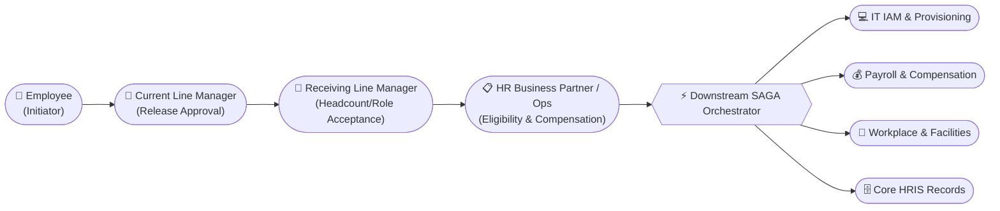
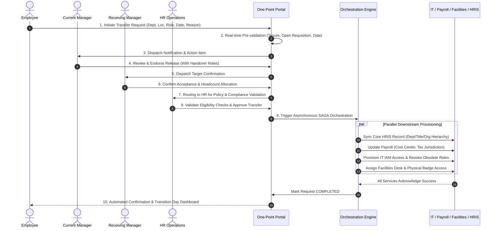
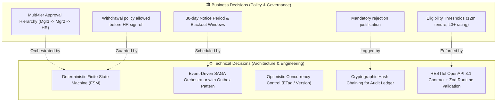

# Deliverable 1: Requirement & Discovery Analysis
## Document Information
- **Project**: One-Point Employee Portal — Internal Transfer Digital Journey
- **Methodology**: INT Specification-Driven Development/Delivery (SDD)
- **Document Version**: 1.0.0
- **Status**: Baselined (Gate 1 Input)
- **Author**: Lead SDD Engineer / Solutions Architect

---

## 1. Business Objective & Context

### 1.1 Executive Summary
In the current operating model, an employee seeking an internal transfer experiences an uncoordinated, multi-system, and high-friction journey. The process requires disjointed manual coordination across the employee, the current line manager, the prospective receiving manager, HR Operations, Payroll, IT Access Management, and Corporate Real Estate / Facilities. 

This fragmented approach introduces significant operational challenges:
- **Average Transfer Cycle Time**: 28–42 business days from intent to completed handover.
- **Opacity & Friction**: Employees have zero visibility into request status, pending stakeholder approvals, or downstream blocker issues.
- **Compliance & Payroll Errors**: Discrepancies in effective dates and cross-entity cost-center mapping frequently cause payroll misalignments and delayed IT provisioning.
- **Talent Retention Risk**: Sluggish internal mobility encourages employees to pursue external opportunities instead of internal career progression.

### 1.2 Strategic Objectives & Target KPIs
The One-Point Employee Portal aims to unify internal talent mobility into a **single, event-driven digital journey** with end-to-end downstream orchestration.

| Target Metric | Baseline (As-Is) | Target (To-Be SDD Journey) | Business Value |
| :--- | :--- | :--- | :--- |
| **End-to-End Cycle Time** | 35 Calendar Days | $\le 5$ Business Days | $85\%$ reduction in administrative turnaround |
| **Self-Service Visibility** | $0\%$ (Email/Ticket chasing) | $100\%$ Real-time status & SLA tracking | Eliminates HR inquiry ticket volume |
| **Data Integrity / First-Time-Right** | $62\%$ (Manual entry errors) | $\ge 99.5\%$ (Automated validation & sync) | Zero payroll mismatch on Day 1 in new role |
| **IT & Facilities Readiness** | Day +3 to Day +7 (Late access) | Day 0 (Ready on Effective Date) | Immediate employee productivity upon transfer |
| **Audit Compliance** | Fragmented email threads | $100\%$ Immutable, cryptographic audit trail | Instant regulatory and SOC2 compliance |

---

## 2. Primary Users & Stakeholder Personas

### 2.1 Persona Specifications

#### Persona 1: The Transferring Employee (Initiator)
- **Profile**: Full-time, permanent employee with at least 12 months of service in their current position.
- **Goals**: Browse available internal roles, submit an internal transfer request with transparent preferences (Department, Location, Role, Effective Date, Optional Reason), and monitor real-time progress across all downstream milestones.
- **Pain Points**: Fear of manager backlash before approval, uncertainty over timeline, delayed IT access or badging issues on day 1.

#### Persona 2: Current Line Manager (Releasing Stakeholder)
- **Profile**: Manager of the employee's current reporting line.
- **Goals**: Review the transfer request, evaluate business impact and backfill needs, agree on a viable release/handover date, and provide structured handover remarks.
- **Pain Points**: Short notice transfers disrupting ongoing delivery; lack of visibility into handover milestones.

#### Persona 3: Receiving Line Manager (Accepting Stakeholder)
- **Profile**: Hiring manager of the target business unit/department.
- **Goals**: Confirm open headcount requisition, validate candidate alignment with role requirements, accept effective transfer date, and initiate onboarding preparations.
- **Pain Points**: Delays in HR/Payroll clearing the candidate; misalignment on budget or band.

#### Persona 4: HR Business Partner / Talent Mobility Lead (Gatekeeper)
- **Profile**: HR Operations specialist responsible for policy adherence and organizational data governance.
- **Goals**: Automatically and manually validate eligibility criteria (tenure, performance rating, disciplinary record, salary band alignment, visa/work authorization), adjust compensation parameters if cross-country/region, and authorize the final transfer.
- **Pain Points**: Manual data verification across legacy HR databases; compliance oversights.

#### Persona 5: Downstream Operational Stakeholders (IT, Facilities, Payroll)
- **IT IAM Operations**: Role-based access provisioning/deprovisioning, software license transfers, hardware dispatch.
- **Payroll Operations**: Relocation tax adjustments, cost-center reallocation, salary band delta adjustments.
- **Facilities / Workplace Services**: Badge update, desk assignment, office access permissions.

---

## 3. Journey Stages (As-Is vs To-Be)

### Detailed Journey Stage Descriptions
1. **Stage 1: Discovery, Self-Check & Initiation**
   - Employee opens the One-Point Portal and navigates to *Internal Talent Mobility*.
   - System auto-populates employee profile, current department, location, supervisor, and tenure.
   - Employee selects target Business Unit, target Office Location, proposed Role/Position, Target Effective Date (must satisfy minimum notice period), and optional Reason.
   - Real-time pre-flight eligibility check alerts employee if criteria are not met before formal submission.

2. **Stage 2: Current Manager Endorsement**
   - Current Line Manager receives action notification with SLA timer (default: 5 business days).
   - Manager reviews request details, reviews replacement strategy, and inputs handover transition notes.
   - Decision options: **Approve / Endorse**, **Request Date Renegotiation**, or **Reject with Justification**.

3. **Stage 3: Receiving Manager Acceptance**
   - Target Line Manager verifies open requisition code, confirms team allocation, and accepts the proposed effective date.
   - Decision options: **Accept Candidate**, **Adjust Target Role/Date**, or **Decline**.

4. **Stage 4: HR Mobility & Compliance Validation**
   - Automated checks verify:
     - Tenure $\ge 12\text{ months}$ in current role.
     - Performance rating $\ge \text{"Meets Expectations"}$ in latest appraisal cycle.
     - No active disciplinary warnings or PIP (Performance Improvement Plan).
     - Legal right to work / visa validity in target location.
   - HR Partner confirms compensation package, job level equivalence, and gives final formal sign-off.

5. **Stage 5: Downstream Orchestration (SAGA Pattern)**
   - Once HR approves, the system transitions request to `ORCHESTRATING_DOWNSTREAM`.
   - The Orchestration Engine executes a coordinated distributed workflow:
     - **HRIS Worker**: Updates organizational unit, reporting manager, and position hierarchy in Core HR.
     - **Payroll Worker**: Re-maps cost center, updates tax jurisdiction, and sets next-pay-cycle effective dates.
     - **IT IAM Worker**: Submits provisioning ticket to Active Directory / Okta, assigns new group entitlements, revokes department-specific legacy entitlements.
     - **Facilities Worker**: Submits CAFM ticket for building access card updates and physical workstation allocation.

6. **Stage 6: Final Confirmation & Transition Handover**
   - Status updates to `COMPLETED`.
   - All stakeholders receive synthesized transition handover dossier.
   - Employee portal renders Day 1 readiness checklist (new manager info, workspace location, IT setup status).

---

## 4. Business Rules Specification (BR-001 to BR-015)

| Rule ID | Category | Description | Enforcement Point | Exception Path |
| :--- | :--- | :--- | :--- | :--- |
| **BR-001** | Tenure | Employee must have completed a minimum of 12 consecutive months in their current role. | Initiation & Pre-flight | HR VP Exception Override |
| **BR-002** | Performance | Employee must have a performance rating of "Meets Expectations" (Level 3/5) or higher in the most recent cycle. | Pre-flight & HR Review | Head of Talent Exemption |
| **BR-003** | Disciplinary | Employee must not have an active Disciplinary Action or formal PIP on record within the last 6 months. | Pre-flight & HR Review | Hard Block (Non-overridable) |
| **BR-004** | Notice Period | Proposed effective date must be at least 30 calendar days from the submission date (or match local employment contractual notice). | Form Validation | Mutually agreed early release by both managers |
| **BR-005** | Headcount Requisition | Receiving department must possess an active, approved, unfulfilled requisition position code. | Form Selection & Receiving Mgr Review | Auto-reject if position cancelled |
| **BR-006** | Single Active Transfer | An employee may have only one active Internal Transfer Request in flight at any given time. | Initiation Submission | Must withdraw active request first |
| **BR-007** | Approval Sequence | Current Manager $\rightarrow$ Receiving Manager $\rightarrow$ HR Operations. Steps cannot be bypassed or executed out of order. | State Machine Guard | None |
| **BR-008** | Withdrawal Rights | Employee may unconditionally withdraw the transfer request at any point prior to HR Final Approval. | Portal Action | Once HR approves, requires HR manual cancellation |
| **BR-009** | Rejection Finality | If any stakeholder (Current Mgr, Receiving Mgr, HR) rejects the request, the request immediately terminates into `REJECTED` state with mandatory recorded rationale. | State Machine Guard | Employee must initiate fresh request |
| **BR-010** | SLA Auto-Escalation | If Current Manager does not act within 5 business days, an automated reminder is dispatched, with escalation to Department Head at Day 7. | Schedulers / Cron | Configurable per geography |
| **BR-011** | Cross-Entity Taxation | If target location is in a different tax jurisdiction or legal entity, HR and Payroll must complete tax compliance check before SAGA trigger. | HR Validation Stage | Legal entity transfer contract addendum required |
| **BR-012** | IT Access Isolation | Legacy department-specific high-privilege access keys must be scheduled for revocation precisely at 23:59 on Effective Date - 1. | IT Provisioning Adapter | Security review |
| **BR-013** | Compensation Band Check | Target role salary grade must fall within standardized grade pay bands; deviations $> 15\%$ require Compensation Committee flag. | HR Validation Stage | Comp & Benefits signoff |
| **BR-014** | Audit Trail Immutability | Every state change, approval, rejection, comment, and system-to-system payload must be recorded in an append-only audit ledger with cryptographic hash chaining. | All State Transitions | Non-negotiable security control |
| **BR-015** | Idempotent Orchestration | All downstream provisioning calls (IT, HRIS, Payroll, Facilities) must accept a unique idempotency key derived from `TransferRequestID + StepName + Version`. | SAGA Execution | Prevents duplicate tickets/entries upon network retries |

---

## 5. Decision Matrix: Business Decisions vs Technical Decisions

To maintain architectural clarity and prevent leaky abstractions, business logic and technical implementation choices are strictly decoupled:

| Decision Area | Business Decision (Policy / Process) | Technical Decision (Architecture / Implementation) | Rationale |
| :--- | :--- | :--- | :--- |
| **Eligibility Validation** | Employee must satisfy 12-month tenure, no active PIP, $\ge$ Level 3 performance rating. | Encapsulate as a pluggable, rule-engine service (`EligibilityService`) with cached pre-flight evaluation and transactional re-verification. | Allows HR policy admins to modify rules without modifying core database schema or orchestration logic. |
| **Approval Flow** | Sequential chain: Current Manager $\rightarrow$ Receiving Manager $\rightarrow$ HR Operations. | Implemented via a guarded **Finite State Machine (FSM)** with explicit state transitions and RBAC role checks. | Guarantees zero out-of-order execution, race conditions, or illegal state jumps. |
| **Downstream Sync** | HRIS, Payroll, IT, and Facilities must all be updated upon HR approval without requiring manual emails. | Implement an asynchronous **SAGA Orchestrator** using the **Transactional Outbox Pattern** with exponential backoff and idempotency keys. | Guarantees eventual consistency across heterogeneous legacy systems without distributed two-phase commit (2PC) bottlenecks. |
| **Data Privacy & PII** | Salary, performance ratings, and transfer justifications are confidential and subject to GDPR / local privacy laws. | Field-level masking, Object-Level Access Control (OLAC / BOLA defense), JWT claims validation, and encrypted storage (AES-256). | Prevents unauthorized peer snooping, privilege escalation, or IDOR leakage. |
| **Audit & Governance** | Regulatory requirement to prove who approved what, when, and under what policy version. | Append-only audit table with SHA-256 tamper-evident hash chaining and actor correlation IDs. | Provides non-repudiation proof for external and internal auditors. |
| **Concurrent Actions** | Prevent scenarios where an employee withdraws while a manager simultaneously approves. | Database-level row versioning and optimistic concurrency control (`version` column checking). | Rejects stale requests with HTTP `409 Conflict` and prompts user to refresh state. |

---

## 6. Known Decisions & Open Questions

### 6.1 Known Decisions (Resolved)
1. **Initiation Channel**: All transfer requests must originate through the One-Point Employee Portal UI / API. Paper forms and direct emails are officially deprecated.
2. **Drafting Capability**: Employees can save incomplete transfer applications as `DRAFT` before committing to formal submission.
3. **Manager Visibility**: The Current Manager only receives notification upon formal submission (`SUBMITTED`), ensuring employee exploratory drafting remains completely private.
4. **Immediate Rejection Feedback**: If rejected at any stage, the initiator receives an automated notification containing the recorded rationale, and the request reaches terminal state `REJECTED`.
5. **System Failure Recovery**: Downstream SAGA tasks that fail temporarily will retry up to 5 times with exponential backoff before generating an alert ticket in the HR Operations Command Center.

### 6.2 Open Questions (Exploration & Clarification Log)

| Q# | Open Question | Stakeholder Impacted | Proposed Recommendation / Baseline Assumption | Status |
| :--- | :--- | :--- | :--- | :--- |
| **OQ-1** | Should managers have the ability to propose an alternative Effective Date rather than flatly rejecting? | Current Manager, Receiving Manager | **Yes.** In v1.1, support a counter-proposal transition `DATE_RENEGOTIATION_REQUESTED`. For v1.0 baseline, manager adds requested date in remarks. | Resolved (v1.0 Baseline Approved) |
| **OQ-2** | What happens if the target role has a different compensation band? | HR, Compensation, Employee | System alerts HR during Stage 4. HR enters revised band; employee must acknowledge revised terms before finalization if salary changes. | Resolved |
| **OQ-3** | How are international transfers with visa requirements handled? | Global Mobility, Legal | Flagged as `CROSS_BORDER_TRANSFER`. Adds a mandatory immigration clearance sub-task before HR final approval. | Documented & Flagged |
| **OQ-4** | Can an employee transfer during an active annual compensation review cycle? | HR Operations | Transfers during the blackout window (Dec 15 – Jan 15) are queued with effective date post-blackout. | Standard Rule BR-004 Applied |

---

## 7. Assumptions & Technical Dependencies

### 7.1 Key Assumptions
- **A-01**: Employee identity, authentication, and organizational hierarchy are reliably provided by enterprise Single Sign-On (SSO / OIDC).
- **A-02**: The enterprise Core HRIS exposes reliable REST/webhook APIs or message queues for employee master data mutations.
- **A-03**: Managers have active corporate email / portal access to respond to pending approvals within standard 5-day SLA.
- **A-04**: System clocks across all microservices and database nodes are synchronized via NTP to ensure audit timestamp integrity.

### 7.2 System Dependencies
1. **Identity Provider (IdP / Okta / Azure AD)**: Provides JWT tokens with claims (`sub`, `employeeId`, `roles`, `departmentId`, `email`).
2. **Core HRIS (Workday / SAP SuccessFactors)**: Target of employee organizational unit, job title, and manager hierarchy updates.
3. **Payroll System (SAP / ADP / Global Payroll)**: Target for cost-center and tax code reassignment.
4. **IT Service Management & IAM (ServiceNow / Okta API)**: Target for automated IAM role bindings and hardware dispatch tickets.
5. **Facilities CAFM (Condeco / Archibus)**: Target for office badge update and desk reservation reassignment.
6. **Enterprise Notification Hub**: Dispatches email, SMS, and in-portal push notifications for workflow events.

---

## 8. Out-of-Scope Items (Boundary Definition)

To ensure focused delivery for the core internal transfer journey, the following items are explicitly marked as out-of-scope for this release:
- ❌ **External Candidate Recruitment**: External hiring and applicant tracking system (ATS) workflows.
- ❌ **Direct Relocation Expense Reimbursement**: Processing physical moving receipts and tax equalization payments (handled via separate Expense Portal).
- ❌ **Automated Visa & Work Permit Filing**: Automated legal filing with government embassies (handled offline by Legal Mobility team).
- ❌ **Performance Management Appraisal System**: Conducting annual performance reviews (One-Point Portal consumes ratings read-only).
- ❌ **Bulk Mass Transfers**: Department-wide restructuring / corporate spin-off mass migrations (handled via specialized data migration tooling).
