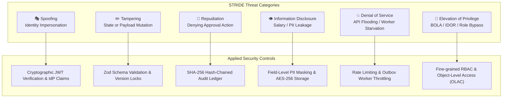
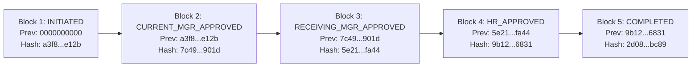

# Deliverable 8: Security Assessment & Threat Model
## Security Architecture, STRIDE Threat Modeling & Compliance Assessment
- **Project**: One-Point Employee Portal — Internal Transfer Digital Journey
- **Document ID**: `SEC-EIT-001`
- **Methodology**: INT Specification-Driven Development/Delivery (SDD)
- **Status**: Baselined & Approved
- **Classification**: Confidential / Internal Security Documentation

---

## 1. Executive Summary & Security Objectives
The Internal Transfer module manages high-sensitivity enterprise data, including employee compensation bands, performance ratings, manager remarks, organizational reporting lines, and downstream IT access entitlements. 

Security objectives:
1. **Zero-Trust Authorization**: Enforce strict Object-Level Access Control (OLAC) to eliminate Broken Object Level Authorization (BOLA / IDOR).
2. **Non-Repudiation & Audit Integrity**: Maintain an append-only, tamper-evident cryptographic hash ledger for all lifecycle actions.
3. **Data Minimization & Confidentiality**: Mask confidential compensation and performance ratings from unauthorized stakeholders.
4. **Resilient Downstream Integration**: Prevent credential leakage or injection attacks during SAGA orchestration across enterprise adapters.

---

## 2. Comprehensive STRIDE Threat Model

### Detailed STRIDE Threat Analysis Matrix

| Threat Category | Threat ID | Threat Description & Attack Vector | Affected Component | Risk Severity (CVSS) | Technical Mitigation & Architectural Defense |
| :--- | :--- | :--- | :--- | :--- | :--- |
| **Spoofing** | `TH-S01` | Malicious actor crafts forged JWT tokens claiming to be a line manager or HR VP. | API Gateway / Auth Middleware | **High (8.2)** | Validate JWT signature using RS256 public keys from enterprise IdP (JWKS); enforce short token lifespan (15 mins) with rotating refresh tokens. |
| **Tampering** | `TH-T01` | Attacker intercepts `POST /transfers` and alters target salary grade or injects unauthorized department codes. | API Controller / Domain Service | **High (7.5)** | Runtime payload validation using strict Zod schemas; reject unknown properties (mass-assignment protection); salary grade resolved server-side from master tables. |
| **Tampering** | `TH-T02` | Database administrator directly edits transfer status in PostgreSQL to bypass manager approvals. | Database / Persistence | **High (7.8)** | Append-only audit table with SHA-256 hash-chaining ($H_n = \text{SHA-256}(H_{n-1} + \text{Payload})$); automated hash verification alerts SOC on tampering. |
| **Repudiation** | `TH-R01` | Manager approves an employee release, then denies taking action when challenged by leadership. | Workflow Engine / Audit Ledger | **Medium (5.4)** | Every approval captures authenticated Actor ID, IP address, timestamp, handover remarks, and generates a digital audit record with unforgeable hash link. |
| **Information Disclosure** | `TH-I01` | Employee queries `GET /transfers/TRF-1001` belonging to a colleague to view compensation band, rating, and relocation remarks. | API Controller / DTO Serializer | **High (8.6)** | Object-Level Access Control (`authorizeTransferAccess` middleware); returns HTTP 403 Forbidden if requester is not initiator, assigned manager, or HR partner. |
| **Information Disclosure** | `TH-I02` | Network eavesdropping on communication between SAGA orchestrator and downstream IT/Payroll services. | Integration Adapters | **Medium (6.1)** | Enforce mutual TLS (mTLS 1.3) with pinned certificates; encrypt credentials and payload secrets using AWS KMS / HashiCorp Vault. |
| **Denial of Service** | `TH-D01` | Malicious script submits 10,000 rapid transfer requests, exhausting worker queue and database connections. | REST API / Task Outbox | **Medium (6.5)** | Rate limiting per employee (max 5 transfer submissions per hour); active transfer singleton rule (`BR-006`); outbox queue worker concurrency bounds. |
| **Elevation of Privilege** | `TH-E01` | Standard employee invokes `POST /transfers/:id/actions/approve-hr` to self-authorize an internal transfer. | Action Endpoints / RBAC Guard | **Critical (9.1)** | Role-Based Access Control (`requireRole('HR_PARTNER')`) combined with verification that the user's active session possesses verified HR claims. |

---

## 3. OWASP API Security Top 10 (2023) Assessment

| OWASP Threat | Risk Assessment & Applicability | Implemented Mitigation |
| :--- | :--- | :--- |
| **API1:2023 Broken Object Level Authorization (BOLA)** | **High Risk**: Direct object reference via transfer request IDs (`/api/v1/transfers/:id`). | Custom OLAC middleware verifies whether `req.user.id` is the initiator, current manager, receiving manager, or member of HR Mobility group. Rejects with HTTP 403. |
| **API2:2023 Broken Authentication** | **Medium Risk**: Session hijacking or token manipulation. | OIDC / OAuth2 Bearer token validation with signature, expiration, and audience verification on every protected route. |
| **API3:2023 Broken Object Property Level Authorization** | **Medium Risk**: Mass assignment on transfer creation or status updates. | Strict Zod validation schemas strip out unexpected fields (e.g. `status`, `id`, `version`) on input payloads. Fields are computed strictly by domain FSM. |
| **API4:2023 Unrestricted Resource Consumption** | **Low Risk**: Excessive requests slowing portal responsiveness. | Express rate-limiter applied to all `/api/v1/` routes (100 req/min per IP; 5 creations/hour per employee). |
| **API5:2023 Broken Function Level Authorization (BFLA)** | **High Risk**: Non-HR users calling administrative or downstream retry endpoints. | Role-guard middleware (`requireRole`) checks specific capability claims before handler execution. |
| **API6:2023 Unrestricted Access to Sensitive Business Flows** | **Medium Risk**: Automated bots triggering mass internal transfers. | Business Rule `BR-006` enforces exactly one active transfer per employee; minimum 12-month tenure rule prevents automated churning. |
| **API7:2023 Server Side Request Forgery (SSRF)** | **Low Risk**: Downstream webhook integrations. | SAGA adapters connect exclusively to hardcoded, internal enterprise endpoints behind service discovery. External URLs are not accepted. |
| **API8:2023 Security Misconfiguration** | **Low Risk**: Verbose error stack traces leaking infrastructure details. | Production error-handling middleware sanitizes all error responses into structured `APIError` objects; stack traces suppressed in production. |
| **API9:2023 Improper Inventory Management** | **Low Risk**: Shadow APIs or legacy transfer endpoints. | All routes versioned under `/api/v1/` with published OpenAPI 3.1 contract. |
| **API10:2023 Unsafe Consumption of APIs** | **Medium Risk**: Malicious or malformed responses from legacy HRIS or Payroll adapters. | All responses from downstream adapters are strictly validated against response schemas before updating state. |

---

## 4. Fine-Grained Role-Based & Object-Level Access Matrix

$$\text{Access}(U, T) = \text{HasRole}(U, \text{RequiredRole}) \land \text{IsStakeholder}(U, T)$$

| User Role / Persona | Initiate Transfer | View Own Transfer | View Peer Transfer | Endorse (Current Mgr) | Accept (Receiving Mgr) | HR Sign-off | Withdraw Request | View Audit Hash Log |
| :--- | :---: | :---: | :---: | :---: | :---: | :---: | :---: | :---: |
| **Employee (Initiator)** | ✅ | ✅ | ❌ | ❌ | ❌ | ❌ | ✅ (Pre-HR) | ✅ |
| **Current Line Manager** | ❌ | ❌ | ❌ (Except Reports)| ✅ | ❌ | ❌ | ❌ | ✅ |
| **Receiving Line Manager**| ❌ | ❌ | ❌ (Except Candidate)| ❌ | ✅ | ❌ | ❌ | ✅ |
| **HR Mobility Partner** | ❌ | ❌ | ✅ (All Requests) | ❌ | ❌ | ✅ | ❌ (Manual Cancel)| ✅ |
| **IT / Payroll / Facilities**| ❌ | ❌ | ❌ | ❌ | ❌ | ❌ | ❌ | ❌ |
| **Security / Compliance Auditor**| ❌ | ❌ | ✅ (Read-Only) | ❌ | ❌ | ❌ | ❌ | ✅ (Full Ledger) |

---

## 5. PII & Data Privacy Compliance (GDPR / CCPA)

1. **Data Minimization**:
   - Transfer request payloads store only necessary references (`employeeId`, `departmentId`, `locationId`, `roleId`).
   - Personal health data, ethnicity, or unneeded demographic details are excluded from transfer records.
2. **Encryption at Rest & In Transit**:
   - All relational database tables and audit ledgers are encrypted at rest using **AES-256-GCM**.
   - All external and intra-service communications enforce **TLS 1.3** with strict cipher suites.
3. **Data Retention & Right to be Forgotten**:
   - Completed transfer records are retained for 7 years in compliance with employment labor law audit mandates.
   - Discarded drafts (`CANCELLED`) and withdrawn requests (`WITHDRAWN`) have personal justifications anonymized after 90 days.

---

## 6. Cryptographic Audit Hash Ledger Design

Each state change generates an immutable ledger record containing a SHA-256 cryptographic link to the previous record:

$$\text{EntryHash}_k = \text{SHA-256}\Big(\text{EntryID}_k \,\|\, \text{Timestamp}_k \,\|\, \text{ActorID}_k \,\|\, \text{Action}_k \,\|\, \text{State}_{k-1} \,\|\, \text{State}_k \,\|\, \text{PrevHash}_{k-1}\Big)$$

If an unauthorized party alters any historical record, all subsequent hash calculations fail verification, providing mathematically provable tamper detection.
